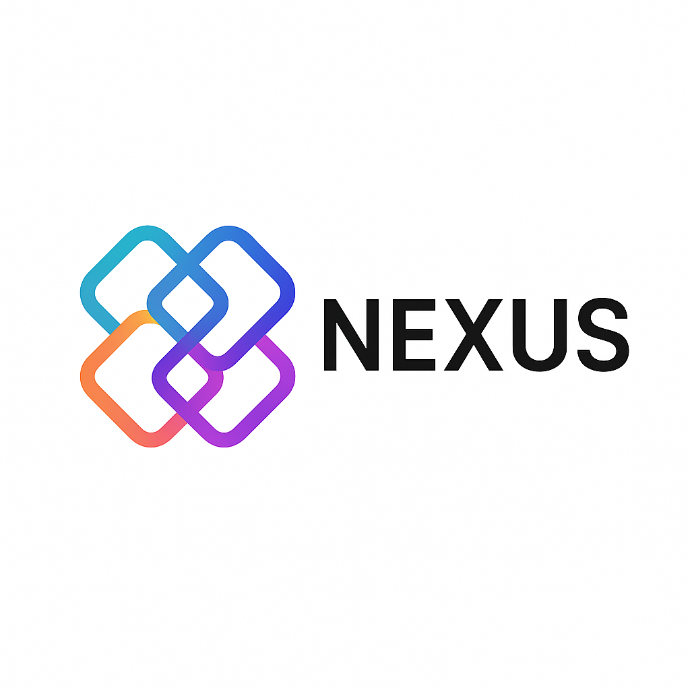

<div align="center">

<picture>
  <source media="(prefers-color-scheme: dark)" srcset="assets/logo.png">
  <source media="(prefers-color-scheme: light)" srcset="assets/logo.png">
  
</picture>

### The filesystem & context plane for AI agents

Give every agent one place to read, write, search, remember, and collaborate — from a single-file script to a fleet of thousands.

[](https://github.com/nexi-lab/nexus/actions/workflows/test.yml)
[](https://pypi.org/project/nexus-ai-fs/)
[](https://pypi.org/project/nexus-fs/)
[](https://www.npmjs.com/package/@nexus-ai-fs/tui)
[](https://www.python.org/downloads/)
[](LICENSE)
[](https://discord.gg/nexus)

[Documentation](https://nexi-lab.github.io/nexus/) · [Quickstart](https://nexi-lab.github.io/nexus/getting-started/quickstart/) · [Examples](examples/) · [PyPI](https://pypi.org/project/nexus-ai-fs/) · [nexus-fs](https://pypi.org/project/nexus-fs/) · [TUI](https://www.npmjs.com/package/@nexus-ai-fs/tui) · [Roadmap](https://github.com/nexi-lab/nexus/issues)

</div>

---

## Why Nexus

Every agent framework gives you tool calling. None gives you a shared filesystem. Without one, agents duplicate files, lose context between runs, step on each other's writes, and can't discover what's already been built.

Nexus fixes this. One VFS-style interface — start embedded in a single Python process, scale to a daemon-backed deployment with auth, permissions, federation, and multi-tenant isolation. No code changes.

## How it works

```
┌─────────────────────────────────────────────────────────────────────────┐
│  BRICKS (runtime-loadable)                                              │
│  ReBAC · Auth · Agents · Delegation · Search · Memory · Governance      │
│  Workflows · Pay · MCP · Snapshots · Catalog · Identity · 25+ more      │
└─────────────────────────────────────────────────────────────────────────┘
                              ↓ protocol interface
┌─────────────────────────────────────────────────────────────────────────┐
│  KERNEL                                                                 │
│  VFS · Metastore · ObjectStore · Syscall dispatch · Pipes ·             │
│  Lock manager · Three-phase write (LSM hooks) · CAS dedup              │
└─────────────────────────────────────────────────────────────────────────┘
                              ↓ dependency injection
┌─────────────────────────────────────────────────────────────────────────┐
│  DRIVERS                                                                │
│  redb · PostgreSQL (pgvector) · S3 · GCS · Dragonfly · Zoekt · gRPC    │
└─────────────────────────────────────────────────────────────────────────┘
```

**Kernel** never changes. **Drivers** swap at config time. **Bricks** mount and unmount at runtime — like `insmod`/`rmmod` for an AI filesystem.

## Requirements

- **Python 3.14+** (Nexus dropped support for 3.12/3.13 in vNEXT). Bare-metal
  `pip install nexus` requires a Rust toolchain because `pdf-inspector` builds
  from sdist until upstream ships cp314 wheels. The official Docker image
  ships Rust and handles this automatically.

## Get started in 30 seconds

### Option A: Docker (recommended)

```bash
pip install nexus-ai-fs                       # CLI + SDK
nexus init --preset demo                       # writes nexus.yaml + nexus-stack.yml
nexus up                                       # pulls image, starts Nexus + Postgres + Dragonfly + Zoekt
eval $(nexus env)                              # load connection vars into your shell
```

Open `http://localhost:2026`. That's it.

### Option B: Embedded (no Docker)

```bash
pip install nexus-ai-fs
```

```python
import asyncio, nexus

async def main():
    nx = await nexus.connect(config={"data_dir": "./my-data"})

    await nx.write("/notes/meeting.md", b"# Q3 Planning\n- Ship Nexus 1.0")
    print((await nx.read("/notes/meeting.md")).decode())

    nx.close()

asyncio.run(main())
```

### Option C: CLI

```bash
nexus write /hello.txt "hello world"
nexus cat /hello.txt
nexus ls /
nexus search query "hello" --mode hybrid
nexus versions history /hello.txt
```

### Terminal UI

The TUI is a separate TypeScript package built on OpenTUI:

```bash
bunx @nexus-ai-fs/tui                                        # published package, connects to localhost:2026
bunx @nexus-ai-fs/tui --url http://remote:2026 --api-key KEY # connect to remote instance
cd packages/nexus-api-client && npm install && npm run build && cd -  # build sibling dependency once in a fresh checkout
cd packages/nexus-tui && bun install && bun run src/index.tsx          # local development from this repo
```

File explorer, API inspector, monitoring dashboard, agent lifecycle management, and more — all from your terminal.

## What you get

| Capability | What it does | How agents use it |
|---|---|---|
| **Filesystem** | POSIX-style read/write/mkdir/ls with CAS dedup | Shared workspace — no more temp files |
| **Versioning** | Every write creates an immutable version | Rollback mistakes, diff changes, audit trails |
| **Snapshots** | Atomic multi-file transactions | Commit or rollback a batch of changes together |
| **Search** | Keyword + semantic + hybrid, powered by Zoekt + pgvector | Find anything by content or meaning |
| **Memory** | Persistent agent memory with consolidation + versioning | Remember across runs and sessions |
| **Delegation** | SSH-style agent-to-agent permission narrowing | Safely sub-delegate work with scoped access |
| **ReBAC** | Relationship-based access control (Google Zanzibar model) | Fine-grained per-file, per-agent permissions |
| **MCP** | Mount external MCP servers, expose Nexus as 30+ MCP tools | Bridge any tool ecosystem |
| **Workflows** | Trigger → condition → action pipelines | Automate file processing, notifications, etc. |
| **Governance** | Fraud detection, collusion rings, trust scores | Safety rails for autonomous agent fleets |
| **Pay** | Credit ledger with reserves, policies, approvals | Metered compute for multi-tenant deployments |
| **IPC** | Inbox-based inter-agent messaging via pipes | Agents talk to each other without polling |
| **Federation** | Multi-zone Raft consensus with mTLS TOFU | Span data centers without a central coordinator |

<details>
<summary><strong>All bricks and system services →</strong></summary>

**Bricks (runtime-loadable):** Access Manifests · Auth (API key, OAuth, mTLS) · Catalog (schema extraction) · Context Manifests · Delegation · Discovery · Identity (DID + credentials) · IPC (pipes) · MCP · Mount · Parsers (50+ formats via pdf-inspector) · Pay · Portability (import/export) · ReBAC · Sandbox (Docker) · Search · Share Links (capability URLs) · Snapshots · Task Manager · TUS Uploads (resumable) · Versioning · Workflows · Workspace

**System services:** Agent Registry · Agent Runtime · Event Bus · Event Log · Namespace · Scheduler (fair-share, priority tiers) · Sync · Lifecycle

</details>

## Framework integrations

Every major agent framework works out of the box:

| Framework | What the example shows | Link |
|---|---|---|
| **Claude Agent SDK** | ReAct agent with Nexus as tool provider | [examples/claude_agent_sdk/](examples/claude_agent_sdk/) |
| **OpenAI Agents** | Multi-tenant agents with shared memory | [examples/openai_agents/](examples/openai_agents/) |
| **LangGraph** | Permission-scoped workflows | [examples/langgraph_integration/](examples/langgraph_integration/) |
| **CrewAI** | Multi-agent collaboration on shared files | [examples/crewai/](examples/crewai/) |
| **Google ADK** | Agent Development Kit integration | [examples/google_adk/](examples/google_adk/) |
| **E2B** | Cloud sandbox execution | [examples/e2b/](examples/e2b/) |
| **CLI** | 40+ shell demos covering every feature | [examples/cli/](examples/cli/) |

## Deployment options

| Mode | What | Who it's for |
|---|---|---|
| **Embedded** | `nexus.connect()` — in-process, zero infrastructure | Scripts, notebooks, single-agent apps |
| **Shared daemon** | `nexus init --preset shared && nexus up` | Teams, multi-agent systems, staging |
| **Federation** | Multi-zone Raft consensus across data centers | Production fleets, edge deployments |

### `nexus init` presets

| Preset | Services | Auth | Use case |
|---|---|---|---|
| `local` | None (embedded) | None | Single-process scripts, notebooks |
| `shared` | Nexus + Postgres + Dragonfly + Zoekt | Static API key | Team dev, multi-agent staging |
| `demo` | Same as shared | Database-backed | Demos, seed data, evaluation |

```bash
# Embedded (no Docker)
nexus init                                    # writes nexus.yaml for local embedded mode

# Shared daemon
nexus init --preset shared                    # writes nexus.yaml + nexus-stack.yml
nexus up                                      # pulls image, starts stack, waits for health
eval $(nexus env)                             # load NEXUS_URL, NEXUS_API_KEY, etc.

# Demo with seed data
nexus init --preset demo && nexus up

# Add optional services
nexus init --preset shared --with nats --with mcp --with frontend

# GPU acceleration
nexus init --preset shared --accelerator cuda

# Pin to a specific version
nexus init --preset shared --image-tag 0.9.4

# Build from local source (for contributors)
nexus up --build                              # build + tag as nexus:local-{hash}
nexus up                                      # reuses local build (no pull)
nexus up --pull                               # discard local build, pull from remote

# Stack lifecycle
nexus stop                                    # pause containers (fast, no teardown)
nexus start                                   # resume paused containers (fast)
nexus down                                    # stop and remove containers
nexus logs                                    # tail logs
nexus restart                                 # down + up
nexus upgrade                                 # pull latest image for your channel

# Environment variables
nexus env                                     # print export statements for your shell
nexus env --json                              # machine-readable
nexus env --dotenv > .env                     # write .env file
nexus run python my_agent.py                  # run command with env vars injected
```

### Docker image

Published to GHCR (multi-arch: amd64 + arm64):

```
ghcr.io/nexi-lab/nexus:stable          # latest release
ghcr.io/nexi-lab/nexus:edge            # latest develop
ghcr.io/nexi-lab/nexus:<version>       # pinned (e.g. 0.9.3)
ghcr.io/nexi-lab/nexus:stable-cuda     # GPU variant
```

## Storage architecture

Four pillars, separated by access pattern — not by domain:

| Pillar | Interface | Capability | Required? |
|---|---|---|---|
| **Metastore** | `MetastoreABC` | Ordered KV, CAS, prefix scan, optional Raft | Yes — sole kernel init param |
| **ObjectStore** | `ObjectStoreABC` | Streaming blob I/O, petabyte scale | Mounted dynamically |
| **RecordStore** | `RecordStoreABC` | Relational ACID, JOINs, vector search | Services only — optional |
| **CacheStore** | `CacheStoreABC` | Ephemeral KV, pub/sub, TTL | Optional (defaults to null) |

The kernel starts with just a Metastore. Everything else is layered on without changing a line of kernel code.

### Cold tiering (Issue #3406)

Sealed CAS volumes are automatically uploaded to S3/GCS when they go quiet, cutting cold storage costs by ~80%. The local redb index is retained for O(1) lookups; reads use a single HTTP range request.

Add to your `nexus.yaml`:

```yaml
tiering:
  enabled: true
  quiet_period: 3600          # seconds before a sealed volume is tiered
  min_volume_size: 104857600  # 100 MB minimum
  cloud_backend: s3           # or gcs
  cloud_bucket: my-bucket
```

Features: write-ahead crash recovery, LRU volume cache with burst detection, streaming downloads (no full-volume RAM buffering), automatic rehydration for burst read patterns.

**Credentials**: AWS env vars / `~/.aws/credentials` / IAM role for S3, or Application Default Credentials for GCS.

**`nexus-fs` (slim package)**: Tiering requires `nexus-ai-fs` (full package). The slim `nexus-fs` package excludes `nexus/services/` where the tiering service lives. If using `nexus-fs`, install cloud extras separately: `pip install nexus-fs[s3]` or `nexus-fs[gcs]`.

## Contributing

```bash
git clone https://github.com/nexi-lab/nexus.git && cd nexus
uv python install 3.14
uv sync --extra dev --extra test
uv run pre-commit install
uv run pytest tests/
```

For semantic search work: `uv sync --extra semantic-search`

**After cloning, pulling, or switching branches that touch `rust/`**, rebuild the Rust extensions:

```bash
just setup        # rebuild all crates (requires: cargo install just)
just doctor       # verify the binary matches current source
```

Or per-crate: `maturin develop --release -m rust/nexus_kernel/Cargo.toml`

> **Why?** `PYTHONPATH=src` only affects pure-Python imports. Native extensions (`nexus_kernel.so`) resolve via site-packages and must be explicitly rebuilt after Rust changes. A stale binary imports silently but fails at runtime with a cryptic `AttributeError`. See [#3712](https://github.com/nexi-lab/nexus/issues/3712).

Claude Code users: see `CLAUDE.md` (local-only, not committed) for the full contributor guide.

## Troubleshooting

<details>
<summary><code>ModuleNotFoundError: No module named 'nexus'</code></summary>

Install from PyPI: `pip install nexus-ai-fs`. The package name on PyPI is `nexus-ai-fs`, not `nexus`.

</details>

<details>
<summary><code>AttributeError: 'Kernel' object has no attribute '...'</code></summary>

The installed `nexus_kernel` binary is stale. Rebuild:

```bash
just setup
# or: maturin develop --release -m rust/nexus_kernel/Cargo.toml
```

</details>

<details>
<summary><code>maturin develop</code> fails at the repo root</summary>

Point maturin at a crate manifest: `maturin develop --release -m rust/nexus_kernel/Cargo.toml`

</details>

<details>
<summary><code>faiss-cpu</code> resolution fails</summary>

Only install semantic search extras on platforms with compatible `txtai`/`faiss-cpu` wheels: `pip install "nexus-ai-fs[semantic-search]"`

</details>

## License

Apache License 2.0 — see [LICENSE](LICENSE) for details.

Built by [Nexi Labs](https://github.com/nexi-lab).
