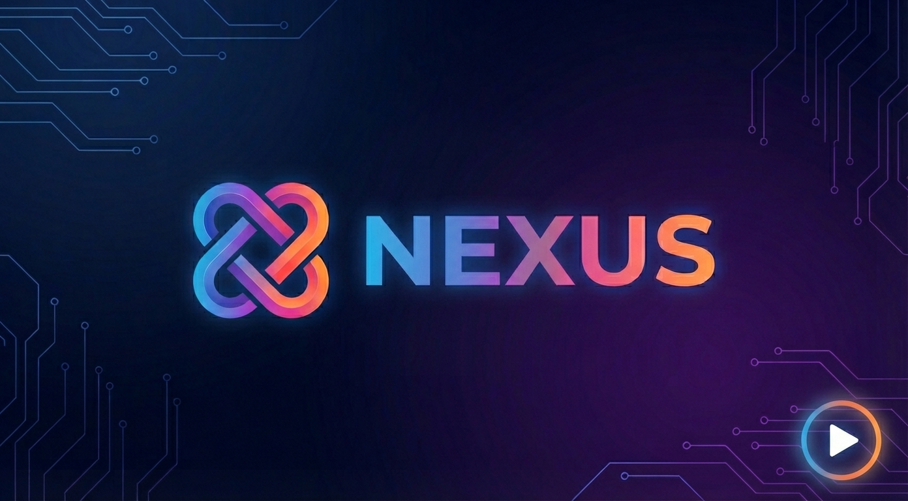
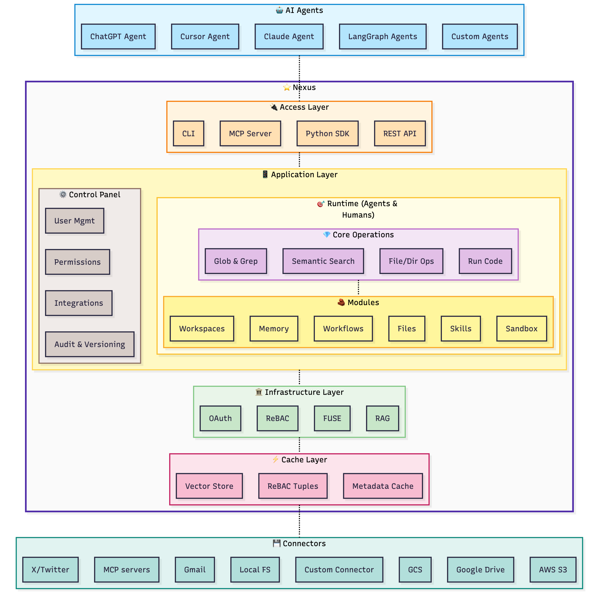

<div align="center">
  

  # Nexus

  [](https://github.com/nexi-lab/nexus/actions/workflows/test.yml)
  [](https://github.com/nexi-lab/nexus/actions/workflows/lint.yml)

  [](https://badge.fury.io/py/nexus-ai-fs)
  [](https://opensource.org/licenses/Apache-2.0)
  [](https://www.python.org/downloads/)

  [Documentation](docs/api/README.md) • [Quickstart](docs/getting-started/quickstart.md) • [PyPI](https://pypi.org/project/nexus-ai-fs/) • [Examples](examples/)
</div>

The AI-native filesystem for cognitive agents.

[](https://youtu.be/bPVQ78Y7Xw4)

⚠️ **Beta**: Nexus is under active development. APIs may change.

## 🎯 What is Nexus?

Nexus is a virtual filesystem server for AI agents. It unifies files, databases, APIs, and SaaS tools into a single path-based API with built-in permissions, memory, semantic search, and skills lifecycle management.

**Humans manage context. Agents operate within it.**

The Nexus Control Panel lets humans curate the files, memories, permissions, and integrations that agents can access—providing oversight and control while agents focus on execution.

This repo contains the open-source [server](src/nexus/server/), [SDK](src/nexus/sdk/), [CLI](src/nexus/cli/), and [examples](examples/).

### Highlights

**Hero Features**
- **Universal Connectors** — One API for local files, S3/GCS, Gmail, Google Drive, X/Twitter, and custom MCP servers
- **Sandboxed Execution** — Run code safely with Docker/E2B integration
- **Grep Everything** — `nexus grep` and semantic search across all backends with connector cache
- **Skills System** — Package agent capabilities with versioning, governance, and exporters (LangGraph, MCP, CLI)

**Core Platform**
- **Control Panel** — User management, permissions, integrations, audit & versioning
- **Runtime Modules** — Workspaces, Memory, Workflows, Files, Skills, Sandbox
- **ReBAC Permissions** — Zanzibar-style access control with multi-tenant isolation

**Advanced**
- Event-driven workflows, semantic search + LLM document reading, content deduplication + versioning, 14 MCP tools, plugin system, batch operations

### Design Principles

- **Everything is a File** — Memories, CRM records, MCP servers, and documents all expose the same interface with paths, metadata, and permissions for unified search and composability.
- **Just-in-Time Retrieval** — Instead of pre-indexing everything, Nexus retrieves exactly what's needed when it's needed, adapting the retrieval strategy to each query.

## 🧑‍💻 Getting Started

### Local Server

```bash
git clone https://github.com/nexi-lab/nexus.git
cd nexus
cp .env.example .env

# Set env
# Required: ANTHROPIC_API_KEY
# Optional: TAVILY_API_KEY, FIRECRAWL_API_KEY, NEXUS_OAUTH_GOOGLE_CLIENT_ID, NEXUS_OAUTH_GOOGLE_CLIENT_SECRET

./scripts/local-demo.sh --start
```

### Docker Server

```bash
./scripts/docker-demo.sh --init
./scripts/docker-demo.sh --start
```

### Python SDK

```bash
pip install nexus-ai-fs
```

```python
import nexus

nx = nexus.connect(config={
    "url": "http://localhost:2026",
    "api_key": "nxk_..."
})

# File operations
nx.write("/workspace/hello.txt", b"Hello, Nexus!")
print(nx.read("/workspace/hello.txt").decode())

# Search across all backends
results = nx.grep("TODO", "/workspace")

# Agent memory
nx.memory.store("User prefers detailed explanations", memory_type="preference")
context = nx.memory.query("What does the user prefer?")

nx.close()
```

### Agent Runtime

```python
# Basic agent loop — message → LLM → tool calls → respond → repeat
result = nx.sys_proc_spawn("agent-1", "zone-1")
tool = nx.sys_dispatch("read_file", {"path": "/docs/readme.md"},
                       agent_id="agent-1", zone_id="zone-1")
status = nx.sys_proc_wait(result["pid"])
```

```python
# Copilot/worker delegation — spawn a restricted worker with a budget cap
result = nx.sys_proc_spawn("researcher", "zone-1", parent_pid=result["pid"])
# Worker inherits a subset of copilot permissions via access manifests
# See docs/architecture/agent-runtime.md for the full orchestration API
```

### CLI

```bash
pip install nexus-ai-fs

export NEXUS_URL="http://localhost:2026"
export NEXUS_API_KEY="nxk_..."

nexus write /workspace/hello.txt "Hello, Nexus!"
nexus cat /workspace/hello.txt
nexus grep "TODO" /workspace
nexus memory store "Important fact" --type fact
```

## 💡 Why Nexus?

| Problem | Nexus Solution |
|---------|----------------|
| Fragmented APIs | One path-based API for all connectors |
| Permission chaos | Zanzibar-style ReBAC with audit trails |
| Ephemeral memory | Persistent memory with semantic retrieval |
| Agent silos | Shared workspaces and skills registry |
| No oversight | Control Panel for human-in-the-loop management |
| Ad-hoc tools | [Skills lifecycle management](https://platform.claude.com/docs/en/agents-and-tools/agent-skills/overview) with versioning, governance, and multi-format export |
| Uncoordinated agents | Process-model runtime with kernel syscalls (spawn, kill, wait) and copilot/worker orchestration |

## 🔧 How Nexus Works



**Access Layer**: Agents connect via CLI, MCP Server, Python SDK, or REST API.

**Application Layer**:
- *Control Panel* — Humans manage users, permissions, integrations, and audit logs
- *Runtime* — Core operations (glob, grep, semantic search, file ops, run code) and modules (workspaces, memory, workflows, files, skills, sandbox)

**Agent Runtime**: Agents run as managed processes with a process-model runtime:

```python
# Basic agent loop — receive message → LLM → tool calls → respond → repeat
from nexus.system_services.agent_runtime import agent_loop, ProcessManager, ToolDispatcher

pm = ProcessManager()
process = await pm.spawn("agent-1", "zone-1")

response = await agent_loop(
    process=process,
    dispatcher=tool_dispatcher,
    session_store=session_store,
    llm_client=llm,
    config=AgentLoopConfig(max_turns=50, parallel_tool_dispatch=True),
    initial_message="Summarize the docs in /workspace",
)
```

```python
# Copilot/worker delegation — spawn restricted workers with budget caps
from nexus.system_services.agent_runtime import CopilotOrchestrator

orchestrator = CopilotOrchestrator(
    process_manager=pm, task_manager=tm, tool_dispatcher=td,
)

result = await orchestrator.delegate(
    copilot_pid=copilot.pid,
    message="Research competitor pricing",
    worker_config=WorkerConfig(
        agent_id="researcher",
        zone_id="zone-1",
        tool_allowlist=("web_search", "read_file"),  # inherit-and-restrict
        budget_tokens=50_000,
    ),
)

task = await orchestrator.collect(result.task_id, zone_id="zone-1")
```

Kernel syscalls (`sys_proc_spawn`, `sys_proc_kill`, `sys_proc_wait`, `sys_dispatch`) expose these operations to the SDK and REST API.

**Infrastructure Layer**: OAuth, ReBAC permissions engine, FUSE mounting, RAG pipelines.

**Cache Layer**: L1 in-memory cache and L2 PostgreSQL cache for vector embeddings, ReBAC tuples, and metadata.

**Connectors**: X/Twitter, MCP servers, Gmail, Local FS, GCS, Google Drive, AWS S3, and custom connectors.

## 📚 Examples

| Framework | Description | Location |
|-----------|-------------|----------|
| CrewAI | Multi-agent collaboration | [examples/crewai/](examples/crewai/) |
| LangGraph | Permission-based workflows | [examples/langgraph_integration/](examples/langgraph_integration/) |
| Claude SDK | ReAct agent pattern | [examples/claude_agent_sdk/](examples/claude_agent_sdk/) |
| OpenAI Agents | Multi-tenant with memory | [examples/openai_agents/](examples/openai_agents/) |
| CLI | 40+ shell demos | [examples/cli/](examples/cli/) |

## 📖 Documentation

- [Installation](docs/getting-started/installation.md)
- [Quick Start](docs/getting-started/quickstart.md)
- [Control Panel Guide](docs/portal/overview.md)
- [API Reference](docs/api/)
- [Skills System](docs/concepts/skills-system.md)
- [Multi-Tenant Architecture](docs/MULTI_TENANT.md)
- [Permissions & ReBAC](docs/PERMISSIONS.md)
- [Agent Runtime](docs/architecture/agent-runtime.md)

## 🤝 Contributing

```bash
git clone https://github.com/nexi-lab/nexus.git
cd nexus
pip install -e ".[dev]"
pre-commit install
pytest tests/
```

See [CONTRIBUTING.md](CONTRIBUTING.md) for guidelines.

## 📝 License

© 2025 Nexi Labs, Inc. Licensed under Apache License 2.0 - See [LICENSE](LICENSE) for details.

---

If Nexus helps your project, please ⭐ the repo!
