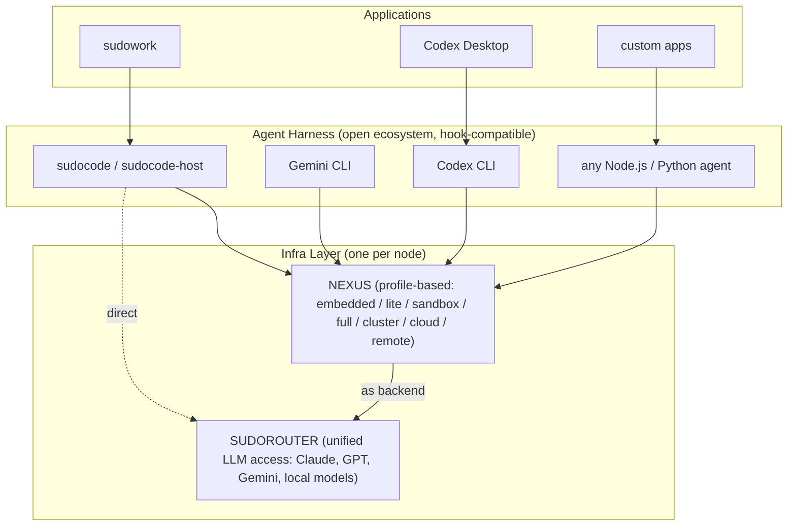
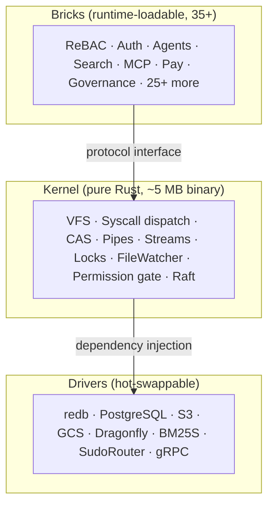

<div align="center">

<picture>
  <source media="(prefers-color-scheme: dark)" srcset="assets/logo.png">
  <source media="(prefers-color-scheme: light)" srcset="assets/logo.png">
  
</picture>

### Distributed VFS kernel for multi-agent systems

The infrastructure layer that decides how agents coexist — storage, communication, permissions, coordination.

[](https://github.com/nexi-lab/nexus/actions/workflows/test.yml)
[](https://pypi.org/project/nexus-ai-fs/)
[](https://pypi.org/project/nexus-fs/)
[](https://www.npmjs.com/package/@nexus-ai-fs/tui)
[](https://www.python.org/downloads/)
[](LICENSE)
[](https://discord.gg/nexus)

[Documentation](https://nexi-lab.github.io/nexus/) · [Quickstart](https://nexi-lab.github.io/nexus/getting-started/quickstart/) · [Examples](examples/) · [PyPI](https://pypi.org/project/nexus-ai-fs/) · [nexus-fs](https://pypi.org/project/nexus-fs/) · [TUI](https://www.npmjs.com/package/@nexus-ai-fs/tui) · [Roadmap](https://github.com/nexi-lab/nexus/issues)

</div>

---

## Why Nexus exists

The hard problem isn't making one agent work. It's making many agents work together reliably across nodes.

Agent harnesses (LangGraph, CrewAI, AutoGen) decide **what** agents do — tool calls, chains, memory loops. But when agents collaborate, every harness re-invents the same unsolved problems: shared storage, permission boundaries, inter-agent messaging, distributed coordination. And every time, the answers are different, fragile, and non-composable.

Nexus is the layer underneath. A distributed VFS kernel — like Linux for AI agents — that provides the primitives any harness needs but none should build:

**Steering engineering** — infrastructure that sets boundaries and rules so agents operate safely at scale:
- Permission boundaries (ReBAC) — agents only touch what they're allowed to
- IPC primitives (DT_PIPE ~0.5us, DT_STREAM append-only log) — zero-copy inter-agent messaging
- Process isolation (ProcessTable, workspace boundaries) — agent crashes don't cascade
- Distributed coordination (Raft consensus, advisory locks) — multi-node without split-brain

**Context engineering** — infrastructure that gives agents the right information at the right time:
- Unified VFS namespace — all data under one path tree, not scattered APIs
- Semantic search (BM25S + pgvector + section-aware grep) — precise context retrieval
- CAS dedup + content chunking — efficient storage and retrieval at scale
- Federation reads — transparent cross-node data access, agents don't need to know where data lives

**Production distributed topology** — not a single-node toy; a full IT infrastructure for agent organizations:

| Node role | Profile | What it does |
|---|---|---|
| **Hub** | `full` | Central server — Postgres, Dragonfly, all 35+ bricks, auth, search |
| **Worker** | `sandbox` | Agent execution sandbox — SQLite + BM25S, zero external deps |
| **Gateway** | `remote` | Thin RPC client — zero local storage, routes to hub |
| **Auditor** | `cluster` + audit | Centralized audit log — every operation across all nodes |
| **Federation peer** | `cloud` | Full + Raft consensus + multi-tenant — spans data centers |
| **Edge** | `lite` / `embedded` | Pi, Jetson, MCU — local-first with federation sync |

These compose like corporate IT: gateway nodes front the traffic, hubs serve the workload, workers run agents in isolation, auditors watch everything, federation peers replicate across regions. One binary, different profiles.

One interface. Start embedded in a single Python process, scale to a federated cluster across data centers. No code changes.

> *Built by [SudoClaw](https://github.com/nexi-lab) — we focus on making agents deliver quality work, with token economy.*

## Architecture

### Deployment stack


```mermaid
graph TD
    subgraph Applications
        SW[sudowork]
        CD[Codex Desktop]
        CA[custom apps]
    end

    subgraph Agent_Harness ["Agent Harness (open ecosystem, hook-compatible)"]
        SC[sudocode / sudocode-host]
        GC[Gemini CLI]
        CX[Codex CLI]
        AH[any Node.js / Python agent]
    end

    subgraph Infra ["Infra Layer (one per node)"]
        NX["NEXUS (profile-based: embedded / lite / sandbox / full / cluster / cloud / remote)"]
        SR["SUDOROUTER (unified LLM access: Claude, GPT, Gemini, local models)"]
    end

    SW --> SC
    CD --> CX
    CA --> AH
    SC --> NX
    GC --> NX
    CX --> NX
    AH --> NX
    SC -.->|direct| SR
    NX -->|as backend| SR
```

Agents don't need to integrate Nexus directly. The **hook layer** (Node.js `fs` interception / Python `open` patching) transparently routes any agent's file I/O through Nexus syscalls — the agent gets federation, A2A, collaboration, approval hooks, and security for free without changing a line of code. **SudoRouter** provides unified model access (any agent, any model, no provider lock-in); agents reach it either through Nexus (as a mounted backend) or directly.

### Nexus internals


```mermaid
graph TD
    subgraph Bricks ["Bricks (runtime-loadable, 35+)"]
        B[ReBAC · Auth · Agents · Search · MCP · Pay · Governance · 25+ more]
    end

    subgraph Kernel ["Kernel (pure Rust, ~5 MB binary)"]
        K[VFS · Syscall dispatch · CAS · Pipes · Streams · Locks · FileWatcher · Permission gate · Raft]
    end

    subgraph Drivers ["Drivers (hot-swappable)"]
        D[redb · PostgreSQL · S3 · GCS · Dragonfly · BM25S · SudoRouter · gRPC]
    end

    B -->|protocol interface| K
    K -->|dependency injection| D
```

**Kernel** is pure Rust — a ~5 MB static binary (`nexusd-cluster`) with 14 syscalls and zero Python dependency. Never changes.

**Drivers** swap at mount time via `sys_setattr`. Hot-plug any storage or LLM backend without restart.

**Bricks** mount and unmount at runtime via `service_enlist` / `service_swap` — like `insmod`/`rmmod` for an AI filesystem.

## Get started in 30 seconds

### Option A: Docker (recommended)

```bash
pip install nexus-ai-fs                       # CLI + SDK
nexus init --preset demo                       # writes nexus.yaml + nexus-stack.yml
nexus up                                       # pulls image, starts Nexus + Postgres + Dragonfly
eval $(nexus env)                              # load connection vars into your shell
```

Open `http://localhost:2026`. That's it.

### Option B: Embedded (no Docker)

```bash
pip install nexus-ai-fs
```

```python
import asyncio, nexus

async def main():
    nx = await nexus.connect(config={"data_dir": "./my-data"})

    await nx.write("/notes/meeting.md", b"# Q3 Planning\n- Ship Nexus 1.0")
    print((await nx.read("/notes/meeting.md")).decode())

    nx.close()

asyncio.run(main())
```

### Option C: CLI

```bash
nexus write /hello.txt "hello world"
nexus cat /hello.txt
nexus ls /
nexus search query "hello" --mode hybrid
nexus grep "TODO" -f "**/*.py"
```

### Terminal UI

```bash
bunx @nexus-ai-fs/tui                                        # connects to localhost:2026
bunx @nexus-ai-fs/tui --url http://remote:2026 --api-key KEY # connect to remote
```

File explorer, API inspector, monitoring dashboard, agent lifecycle management, and more.

## What you get

| Capability | What it does | How agents use it |
|---|---|---|
| **Filesystem** | POSIX-style read/write/mkdir/ls with CAS dedup | Shared workspace — no more temp files |
| **Versioning** | Every write creates an immutable version | Rollback mistakes, diff changes, audit trails |
| **Snapshots** | Atomic multi-file transactions | Commit or rollback a batch of changes together |
| **Search** | BM25S + semantic + hybrid + section-aware grep | Find anything by content, meaning, or structure |
| **Memory** | Persistent agent memory with consolidation + versioning | Remember across runs and sessions |
| **Delegation** | SSH-style agent-to-agent permission narrowing | Safely sub-delegate work with scoped access |
| **ReBAC** | Relationship-based access control (Google Zanzibar model) | Fine-grained per-file, per-agent permissions |
| **MCP** | Mount external MCP servers, expose Nexus as 30+ MCP tools | Bridge any tool ecosystem |
| **Workflows** | Trigger / condition / action pipelines | Automate file processing, notifications, etc. |
| **Governance** | Fraud detection, collusion rings, trust scores | Safety rails for autonomous agent fleets |
| **Pay** | Credit ledger with reserves, policies, approvals | Metered compute for multi-tenant deployments |
| **IPC** | DT_PIPE (FIFO) + DT_STREAM (append-only log) | Sub-microsecond inter-agent messaging |
| **Federation** | Multi-zone Raft consensus with mTLS TOFU | Span data centers without a central coordinator |
| **Sandbox** | Docker-backed execution environments | Isolated code execution per agent |

<details>
<summary><strong>All bricks and system services</strong></summary>

**Bricks (runtime-loadable):** A2A Protocol . Access Manifests . Agent Log . Approvals . Archive . Artifact Index . Auth (API key, OAuth, mTLS) . Catalog (schema extraction) . Context Manifests . Delegation . Discovery . Filesystem . Governance . Identity (DID + credentials) . IPC (pipes + streams) . MCP . Mount . Parsers (50+ formats) . Pay . Portability (import/export) . ReBAC . Reputation . Sandbox (Docker) . Secrets . Search . Share Links (capability URLs) . Snapshots . Task Manager . Tools . Upload (TUS resumable) . Versioning . Watch . Workflows . Workspace

**System services:** Agent Registry . Agent Runtime . Event Bus . Namespace . Scheduler (fair-share, priority tiers)

</details>

## Framework integrations

Every major agent framework works out of the box:

| Framework | What the example shows | Link |
|---|---|---|
| **Claude Agent SDK** | ReAct agent with Nexus as tool provider | [examples/claude_agent_sdk/](examples/claude_agent_sdk/) |
| **OpenAI Agents** | Multi-tenant agents with shared memory | [examples/openai_agents/](examples/openai_agents/) |
| **LangGraph** | Permission-scoped workflows | [examples/langgraph_integration/](examples/langgraph_integration/) |
| **CrewAI** | Multi-agent collaboration on shared files | [examples/crewai/](examples/crewai/) |
| **Google ADK** | Agent Development Kit integration | [examples/google_adk/](examples/google_adk/) |
| **E2B** | Cloud sandbox execution | [examples/e2b/](examples/e2b/) |
| **CLI** | 40+ shell demos covering every feature | [examples/cli/](examples/cli/) |

## Deployment options

| Mode | What | Who it's for |
|---|---|---|
| **Embedded** | `nexus.connect()` — in-process, zero infrastructure | Scripts, notebooks, single-agent apps |
| **Shared daemon** | `nexus init --preset shared && nexus up` | Teams, multi-agent systems, staging |
| **Federation** | Multi-zone Raft consensus across data centers | Production fleets, edge deployments |

### `nexus init` presets

| Preset | Services | Auth | Use case |
|---|---|---|---|
| `local` | None (embedded) | None | Single-process scripts, notebooks |
| `shared` | Nexus + Postgres + Dragonfly | Static API key | Team dev, multi-agent staging |
| `demo` | Same as shared | Database-backed | Demos, seed data, evaluation |

```bash
# Embedded (no Docker)
nexus init                                    # writes nexus.yaml for local embedded mode

# Shared daemon
nexus init --preset shared                    # writes nexus.yaml + nexus-stack.yml
nexus up                                      # pulls image, starts stack, waits for health
eval $(nexus env)                             # load NEXUS_URL, NEXUS_API_KEY, etc.

# Demo with seed data
nexus init --preset demo && nexus up

# Add optional services
nexus init --preset shared --with nats --with mcp --with frontend

# GPU acceleration
nexus init --preset shared --accelerator cuda

# Stack lifecycle
nexus stop                                    # pause containers
nexus start                                   # resume
nexus down                                    # stop and remove
nexus logs                                    # tail logs
nexus restart                                 # down + up
nexus upgrade                                 # pull latest image
```

### Docker image

Published to GHCR (multi-arch: amd64 + arm64):

```
ghcr.io/nexi-lab/nexus:stable          # latest release
ghcr.io/nexi-lab/nexus:edge            # latest develop
ghcr.io/nexi-lab/nexus:<version>       # pinned (e.g. 0.9.3)
ghcr.io/nexi-lab/nexus:stable-cuda     # GPU variant
```

## Storage architecture

Four pillars, separated by access pattern — not by domain:

| Pillar | Interface | Capability | Required? |
|---|---|---|---|
| **Metastore** | `MetastoreABC` | Ordered KV, CAS, prefix scan, optional Raft | Yes — sole kernel init param |
| **ObjectStore** | `ObjectStoreABC` | Streaming blob I/O, petabyte scale | Mounted dynamically |
| **RecordStore** | `RecordStoreABC` | Relational ACID, JOINs, vector search | Services only — optional |
| **CacheStore** | `CacheStoreABC` | Ephemeral KV, pub/sub, TTL | Optional (defaults to null) |

The kernel starts with just a Metastore. Everything else is layered on without changing a line of kernel code.

## Performance

### Agent-level: context engineering

Nexus Dynamic Discovery vs loading all tools into the LLM context (POC on [BFCL benchmark](https://gorilla.cs.berkeley.edu/leaderboard.html)):

| Metric | Static (all tools in context) | Nexus Dynamic Discovery |
|---|---|---|
| Irrelevance detection accuracy | 40-80% | **100%** |
| Token consumption (65 tools) | ~276K | **~61K (78% reduction)** |
| Hallucination on irrelevant tools | frequent | **zero** |
| ECCA-R (cost per reliable answer) | high | **2x better** |

Dynamic Discovery only loads relevant tools on demand via score-based search, so the LLM sees a clean context instead of 65+ tool definitions. Details: [nexus-benchmarks](https://github.com/nexi-lab/nexus-benchmarks).

### Kernel-level: steering overhead is negligible

Kernel syscall latency (pure Rust, PathLocal + redb, Apple M-series):

| Syscall | Latency | What's included |
|---|---|---|
| `sys_stat` | **~727 ns** | redb lookup + permission lease check |
| `sys_read` 1 KB | **~3.4 us** | permission + CAS resolve + hook dispatch + I/O |
| `sys_readdir` 100 entries | **~68 us** | metastore + backend merge |
| `sys_rename` | **~6.6 us** | atomic metastore + backend |

The full steering stack (permission check, CAS resolution, hook dispatch, metastore lookup) adds < 2 us to a read. An LLM call takes 100-1000 ms. The infrastructure is invisible at agent-interaction timescales.

## Requirements

- **Python 3.14+** for the SDK and CLI
- **Rust toolchain** only needed for building from source (the Docker image and `nexusd-cluster` binary ship pre-built)

## Contributing

```bash
git clone https://github.com/nexi-lab/nexus.git && cd nexus
uv python install 3.14
uv sync --extra dev --extra test
uv run pre-commit install
uv run pytest tests/
```

For semantic search work: `uv sync --extra semantic-search`

Claude Code users: see `CLAUDE.md` (local-only, not committed) for the full contributor guide.

## Troubleshooting

<details>
<summary><code>ModuleNotFoundError: No module named 'nexus'</code></summary>

Install from PyPI: `pip install nexus-ai-fs`. The package name on PyPI is `nexus-ai-fs`, not `nexus`.

</details>

## License

Apache License 2.0 — see [LICENSE](LICENSE) for details.

Built by [Nexi Labs](https://github.com/nexi-lab).
