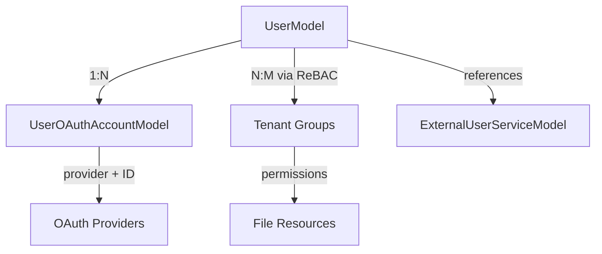

# User Authentication & Multi-Tenant System

**Version:** 1.0
**Last Updated:** December 2024
**Status:** Production Design

---

## Table of Contents

1. [Executive Summary](#executive-summary)
2. [Architecture Overview](#architecture-overview)
3. [Current State Analysis](#current-state-analysis)
4. [Design Goals](#design-goals)
5. [Core Data Models](#core-data-models)
6. [Multi-Tenant Architecture](#multi-tenant-architecture)
7. [Authentication Flows](#authentication-flows)
8. [API Design](#api-design)
9. [Implementation Guide](#implementation-guide)
10. [Security Considerations](#security-considerations)
11. [Risk Assessment & Mitigation](#risk-assessment--mitigation)
12. [Implementation Plan](#implementation-plan)
13. [Review Checklist](#review-checklist)

---

## Executive Summary

This document describes a comprehensive user authentication and multi-tenant management system for Nexus, supporting:

### Supported Authentication Methods

1. **Username + Password** - Local accounts with persistent storage
2. **Google OAuth** - SSO for user login
3. **External User Management** - Bring your own user model/server

### Key Features

- **Persistent user storage** with profile data (email, name, avatar)
- **OAuth account linking** for Google authentication
- **External user service integration** for custom auth systems
- **Multi-tenant support** via ReBAC groups (Google Zanzibar pattern)
- **Backward compatible** with existing API key authentication
- **Soft delete support** for audit trail and data recovery

### Important Distinction

This design addresses **server authentication** (who can access Nexus), which is separate from **backend OAuth integrations** (accessing Google Drive, Gmail, etc.). The existing `OAuthCredentialModel` handles backend integrations and will continue to work alongside this design.

### Architecture Highlights

- **One UserModel per email** - Centralized user identity
- **Multiple tenants per user** - Via ReBAC groups (no separate membership table)
- **UUID-based user IDs** - Secure, consistent, non-enumerable
- **Soft delete by default** - Preserves audit trail
- **ReBAC-based permissions** - Leverages existing Google Zanzibar infrastructure

---

## Architecture Overview

### System Architecture

```
┌─────────────────────────────────────────────────────────────────┐
│                        Authentication Layer                      │
├─────────────────────────────────────────────────────────────────┤
│                                                                   │
│  ┌──────────────┐  ┌──────────────┐  ┌──────────────┐          │
│  │   Password   │  │    OAuth     │  │   External   │          │
│  │     Auth     │  │     Auth     │  │  User Auth   │          │
│  └──────┬───────┘  └──────┬───────┘  └──────┬───────┘          │
│         │                  │                  │                   │
│         └──────────────────┴──────────────────┘                  │
│                            │                                      │
│                            ▼                                      │
│                   ┌────────────────┐                             │
│                   │  UserModel DB  │                             │
│                   └────────┬───────┘                             │
│                            │                                      │
└────────────────────────────┼──────────────────────────────────────┘
                             │
┌────────────────────────────┼──────────────────────────────────────┐
│                 Multi-Tenant Layer (ReBAC)                        │
├────────────────────────────┼──────────────────────────────────────┤
│                            ▼                                      │
│         ┌─────────────────────────────────────┐                  │
│         │     ReBAC Groups & Permissions      │                  │
│         │                                      │                  │
│         │  (user:alice, member, group:tenant) │                  │
│         │  (group:tenant, owner, file:path)   │                  │
│         └─────────────────────────────────────┘                  │
│                                                                   │
└───────────────────────────────────────────────────────────────────┘
```

### User Identity & Tenant Membership

```
UserModel (alice@example.com)
├── user_id: "uuid-123" (UUID, globally unique)
├── email: "alice@example.com" (unique across all tenants)
├── password_hash: "bcrypt..." (if password auth)
└── ReBAC Group Memberships:
    ├── (user:uuid-123, member-of, group:tenant-acme)
    └── (user:uuid-123, member-of, group:tenant-techcorp)

Tenant Permissions (via ReBAC)
├── (group:tenant-acme, owner-of, file:/workspace/acme/...)
└── (group:tenant-techcorp, owner-of, file:/workspace/techcorp/...)
```

**Key Insight**: One email address = one UserModel, but users can belong to multiple tenants via ReBAC group memberships.

### Data Model Relationships



---

## Current State Analysis

### Existing Infrastructure

1. **Authentication System**:
   - `AuthProvider` interface with multiple implementations:
     - `LocalAuth`: In-memory username/password (JWT tokens) - **no persistence**
     - `DatabaseAPIKeyAuth`: API key-based authentication - **works well**
     - `OIDCAuth`: OAuth/OIDC token validation - **works but no user linking**
     - `StaticAPIKeyAuth`: Static API keys

2. **Current Data Models**:
   - `APIKeyModel`: Stores API keys with `user_id` reference (string, no FK constraint)
   - `OAuthCredentialModel`: Stores OAuth tokens for **backend integrations** (Google Drive, Gmail, etc.)
   - `UserSessionModel`: Tracks user sessions
   - **No dedicated `UserModel` table exists**

3. **Authentication Flow**:
   - Server authentication validates tokens → returns `AuthResult` with `subject_id`, `tenant_id`, `is_admin`
   - Authorization uses ReBAC (Relationship-Based Access Control)
   - Multi-tenant isolation via `tenant_id`

4. **OAuth Infrastructure** (for backend integrations):
   - `OAuthProvider` base class with `GoogleOAuthProvider`, `MicrosoftOAuthProvider`
   - `OAuthCredentialModel` stores encrypted tokens for accessing external services
   - TokenManager handles token refresh and encryption
   - **This is separate from user authentication OAuth**

### Gaps

1. **No persistent user storage**: `LocalAuth` uses in-memory dict (lost on restart)
2. **No user profile data**: Only `user_id` strings, no email, name, avatar, etc.
3. **No OAuth user linking**: OIDC tokens validated but not linked to persistent user accounts
4. **No external user support**: Cannot delegate to external user service
5. **No user registration**: Users must be created via API keys or admin commands
6. **No password management**: Cannot change passwords, reset passwords, etc.

---

## Design Goals

1. **Flexible authentication**: Support multiple auth methods (password, OAuth, external)
2. **User profile management**: Store user metadata (email, name, avatar, etc.)
3. **OAuth integration**: Link OAuth providers to user accounts
4. **External user support**: Allow users to bring their own user management
5. **Backward compatibility**: Existing API key auth continues to work
6. **Multi-tenant**: Support tenant isolation at user level via ReBAC groups
7. **Security**: Email verification, password reset, account takeover prevention

---

## Core Data Models

### 1. UserModel

Stores user identity and profile information. Supports multiple authentication methods.

```python
class UserModel(Base):
    """Core user account model.

    Stores user identity and profile information.
    Supports multiple authentication methods and external user management.

    Key features:
    - Multiple auth methods (password, OAuth, external, API key)
    - Multi-tenant support via ReBAC groups
    - Soft delete support (is_active, deleted_at)
    - Email/username uniqueness via partial indexes
    """

    __tablename__ = "users"

    # Primary key - UUID for all new users
    user_id: Mapped[str] = mapped_column(
        String(255), primary_key=True
    )

    # Identity (uniqueness enforced via partial indexes)
    username: Mapped[str | None] = mapped_column(
        String(255), nullable=True, index=True
    )
    email: Mapped[str | None] = mapped_column(
        String(255), nullable=True, index=True
    )

    # Profile
    display_name: Mapped[str | None] = mapped_column(String(255), nullable=True)
    avatar_url: Mapped[str | None] = mapped_column(Text, nullable=True)

    # Authentication
    password_hash: Mapped[str | None] = mapped_column(
        String(512), nullable=True
    )  # Bcrypt/argon2/scrypt
    primary_auth_method: Mapped[str] = mapped_column(
        String(50), nullable=False, default="password", index=True
    )  # 'password', 'oauth', 'external', 'api_key'

    # External user management
    external_user_id: Mapped[str | None] = mapped_column(
        String(255), nullable=True, index=True
    )
    external_user_service: Mapped[str | None] = mapped_column(
        String(100), nullable=True, index=True
    )

    # API key (for programmatic access)
    api_key: Mapped[str | None] = mapped_column(
        String(255), nullable=True, index=True
    )

    # Tenant membership (via ReBAC groups only - no tenant_id field)
    # Managed via: (user:user_id, member-of, group:tenant-{tenant_id})

    # Admin status
    is_global_admin: Mapped[int] = mapped_column(
        Integer, default=0, nullable=False
    )  # Global admin across all tenants

    # Status (soft delete support)
    is_active: Mapped[int] = mapped_column(
        Integer, default=1, nullable=False, index=True
    )
    deleted_at: Mapped[datetime | None] = mapped_column(
        DateTime, nullable=True, index=True
    )
    email_verified: Mapped[int] = mapped_column(
        Integer, default=0, nullable=False
    )

    # Metadata
    metadata: Mapped[str | None] = mapped_column(Text, nullable=True)  # JSON

    # Timestamps
    created_at: Mapped[datetime] = mapped_column(
        DateTime, nullable=False, default=lambda: datetime.now(UTC), index=True
    )
    updated_at: Mapped[datetime] = mapped_column(
        DateTime, nullable=False,
        default=lambda: datetime.now(UTC),
        onupdate=lambda: datetime.now(UTC)
    )
    last_login_at: Mapped[datetime | None] = mapped_column(
        DateTime, nullable=True, index=True
    )

    # Relationships
    oauth_accounts: Mapped[list["UserOAuthAccountModel"]] = relationship(
        "UserOAuthAccountModel", back_populates="user", cascade="all, delete-orphan"
    )

    # Indexes (partial unique indexes created via migration SQL)
    __table_args__ = (
        Index("idx_users_email", "email"),
        Index("idx_users_username", "username"),
        Index("idx_users_auth_method", "primary_auth_method"),
        Index("idx_users_external", "external_user_service", "external_user_id"),
        Index("idx_users_active", "is_active"),
        Index("idx_users_deleted", "deleted_at"),
        Index("idx_users_email_active_deleted", "email", "is_active", "deleted_at"),
    )
```

**Important**: Email/username uniqueness is enforced via partial indexes (active users only):
```sql
CREATE UNIQUE INDEX idx_users_email_active ON users(email)
    WHERE is_active=1 AND deleted_at IS NULL AND email IS NOT NULL;
CREATE UNIQUE INDEX idx_users_username_active ON users(username)
    WHERE is_active=1 AND deleted_at IS NULL AND username IS NOT NULL;
```

### 2. UserOAuthAccountModel

Links external OAuth providers to user accounts for authentication.

```python
class UserOAuthAccountModel(Base):
    """OAuth provider accounts linked to users for authentication.

    Purpose: Links external OAuth providers (Google, GitHub, etc.) to user accounts
    for server authentication (login). Separate from OAuthCredentialModel which stores
    tokens for backend integrations (Google Drive, Gmail, etc.).

    Key Distinction:
    - UserOAuthAccountModel: User logs in with Google → gets Nexus access
    - OAuthCredentialModel: User connects Google Drive → accesses their files
    """

    __tablename__ = "user_oauth_accounts"

    oauth_account_id: Mapped[str] = mapped_column(
        String(36), primary_key=True, default=lambda: str(uuid.uuid4())
    )

    user_id: Mapped[str] = mapped_column(
        String(255),
        ForeignKey("users.user_id", ondelete="CASCADE"),
        nullable=False,
        index=True
    )

    # OAuth provider
    provider: Mapped[str] = mapped_column(
        String(50), nullable=False, index=True
    )  # 'google', 'github', 'microsoft'
    provider_user_id: Mapped[str] = mapped_column(
        String(255), nullable=False, index=True
    )  # OAuth provider's user ID (e.g., Google 'sub')
    provider_email: Mapped[str | None] = mapped_column(
        String(255), nullable=True, index=True
    )

    # Token storage (ID token only)
    encrypted_id_token: Mapped[str | None] = mapped_column(
        Text, nullable=True
    )  # Encrypted ID token for authentication verification
    token_expires_at: Mapped[datetime | None] = mapped_column(
        DateTime, nullable=True
    )

    # Profile data
    provider_profile: Mapped[str | None] = mapped_column(
        Text, nullable=True
    )  # JSON: name, picture, etc.

    # Timestamps
    created_at: Mapped[datetime] = mapped_column(
        DateTime, nullable=False, default=lambda: datetime.now(UTC)
    )
    last_used_at: Mapped[datetime | None] = mapped_column(DateTime, nullable=True)

    # Relationships
    user: Mapped["UserModel"] = relationship(
        "UserModel", back_populates="oauth_accounts"
    )

    # Indexes
    __table_args__ = (
        UniqueConstraint("provider", "provider_user_id", name="uq_provider_user"),
        Index("idx_oauth_user", "user_id"),
        Index("idx_oauth_provider", "provider"),
        Index("idx_oauth_provider_user", "provider", "provider_user_id"),
    )
```

**Security Note**: Only ID tokens are stored (short-lived, for verification). Access/refresh tokens are NOT stored to minimize security risk.

### 3. ExternalUserServiceModel

Configuration for external user management services (Auth0, Okta, custom).

```python
class ExternalUserServiceModel(Base):
    """Configuration for external user management services.

    Allows Nexus to delegate user authentication/authorization to external services.
    """

    __tablename__ = "external_user_services"

    service_id: Mapped[str] = mapped_column(
        String(36), primary_key=True, default=lambda: str(uuid.uuid4())
    )

    service_name: Mapped[str] = mapped_column(
        String(100), nullable=False, unique=True, index=True
    )  # 'auth0', 'okta', 'custom'

    # Service endpoints (MUST be validated against whitelist - SSRF prevention)
    auth_endpoint: Mapped[str] = mapped_column(
        Text, nullable=False
    )  # JWKS URI, userinfo endpoint, etc.
    user_lookup_endpoint: Mapped[str | None] = mapped_column(
        Text, nullable=True
    )

    auth_method: Mapped[str] = mapped_column(
        String(50), nullable=False
    )  # 'jwt', 'api_key', 'oauth', 'custom'

    # Configuration (encrypted - contains secrets)
    encrypted_config: Mapped[str | None] = mapped_column(
        Text, nullable=True
    )  # Encrypted JSON: client_id, client_secret, audience, etc.

    is_active: Mapped[int] = mapped_column(
        Integer, default=1, nullable=False
    )

    created_at: Mapped[datetime] = mapped_column(
        DateTime, nullable=False, default=lambda: datetime.now(UTC)
    )
    updated_at: Mapped[datetime] = mapped_column(
        DateTime, nullable=False,
        default=lambda: datetime.now(UTC),
        onupdate=lambda: datetime.now(UTC)
    )
```

---

## Multi-Tenant Architecture

### Design Decision: ReBAC Groups (Google Zanzibar Pattern)

Instead of creating a separate membership table, we use **ReBAC groups** to model tenant membership. This leverages Nexus's existing ReBAC infrastructure and follows industry-standard patterns.

### Why ReBAC Groups?

✅ **Leverages existing infrastructure** - No new tables needed
✅ **Follows Google Zanzibar pattern** - Industry standard
✅ **Automatic permission inheritance** - Group permissions flow to members
✅ **Consistent with Nexus** - All permissions via ReBAC
✅ **Flexible roles** - Easy to add new roles via different groups
✅ **Audit trail** - All memberships tracked in ReBAC tuples

### Group Naming Convention

```
Tenant groups: group:tenant-{tenant_id}
Admin groups:  group:tenant-{tenant_id}-admins
Member groups: group:tenant-{tenant_id}-members
```

Examples:
- `group:tenant-acme`
- `group:tenant-acme-admins`
- `group:tenant-techcorp-members`

### Adding User to Tenant

```python
# Add user as member
rebac_create(
    subject=("user", user_id),
    relation="member",
    object=("group", f"tenant-{tenant_id}"),
    tenant_id=tenant_id
)

# Add user as admin
rebac_create(
    subject=("user", user_id),
    relation="member",
    object=("group", f"tenant-{tenant_id}-admins"),
    tenant_id=tenant_id
)
```

### Permission Flow

```
1. Grant permissions to tenant group:
   (group:tenant-acme, owner-of, file:/workspace/acme/doc.txt)

2. User is member of group:
   (user:alice, member-of, group:tenant-acme)

3. Permission check:
   rebac_check(
       subject=("user", "alice"),
       permission="read",
       object=("file", "/workspace/acme/doc.txt")
   )

4. ReBAC traverses graph:
   user:alice → member-of → group:tenant-acme → owner-of → file

5. Returns: True (permission granted)
```

### Multi-Tenant Use Cases

1. **Consultant/Contractor**: Works with multiple organizations
   - Alice belongs to `tenant-acme` (admin) and `tenant-techcorp` (member)
   - Single login, can switch between tenants

2. **Partner Organization**: Partner needs access to multiple clients
   - Bob belongs to `tenant-client-a` and `tenant-client-b`
   - Different roles in each tenant

3. **Internal Employee**: Works in multiple departments
   - Charlie belongs to `tenant-engineering` and `tenant-sales`
   - Can access both workspaces

### Helper Functions

```python
def tenant_group_id(tenant_id: str) -> str:
    """Generate tenant group ID from tenant_id."""
    return f"tenant-{tenant_id}"

def add_user_to_tenant(
    rebac_manager,
    user_id: str,
    tenant_id: str,
    role: str = "member"
) -> str:
    """Add user to tenant via ReBAC group."""
    group_id = tenant_group_id(tenant_id)
    if role == "admin":
        group_id = f"{group_id}-admins"

    return rebac_manager.rebac_write(
        subject=("user", user_id),
        relation="member",
        object=("group", group_id),
        tenant_id=tenant_id
    )

def get_user_tenants(rebac_manager, user_id: str) -> list[dict]:
    """Get all tenants user belongs to."""
    tuples = rebac_manager.rebac_query(
        subject=("user", user_id),
        relation="member",
        object_type="group"
    )

    tenants = []
    for tuple in tuples:
        group_id = tuple.object.entity_id
        if group_id.startswith("tenant-"):
            parts = group_id.replace("tenant-", "").split("-")
            tenant_id = parts[0]
            role = "admin" if "admins" in group_id else "member"
            tenants.append({"tenant_id": tenant_id, "role": role})

    return tenants
```

---

## Authentication Flows

### 1. Username + Password Flow

```
User → POST /auth/register {username, email, password}
  → Validate uniqueness (email, username)
  → Hash password with bcrypt (12+ rounds)
  → Generate UUID for user_id
  → Create UserModel
  → Send verification email
  → Add user to default tenant via ReBAC
  → Generate JWT token
  → Return {token, user_info}

User → POST /auth/login {username/email, password}
  → Lookup user by username or email
  → Verify password_hash with bcrypt
  → Update last_login_at
  → Generate JWT token
  → Return {token, user_info}
```

### 2. Google OAuth Flow (Server Authentication)

**Note**: This is for user login/authentication, separate from backend OAuth integrations.

```
User → Frontend initiates Google OAuth
  → Google redirects with authorization code

Frontend → POST /auth/oauth/check {provider: 'google', code, state}
  → Backend exchanges code for tokens (ID token + access token)
  → Extract user info from ID token (email, sub, name, picture)
  → Check if existing OAuth account:
     - Query UserOAuthAccountModel for (provider='google', provider_user_id=sub)

  IF existing OAuth account:
    → Return {token, user_info, needs_confirmation: false}
    → User logged in immediately

  ELSE (new user):
    → Check if email exists in UserModel AND both emails verified
    → If yes: Could link to existing account (requires confirmation)
    → Return {needs_confirmation: true, pending_token, user_info, tenant_info}
    → Show confirmation page to user

Frontend → POST /auth/oauth/confirm {pending_token, tenant_name}
  → Verify pending_token
  → Create UserModel (or link to existing)
  → Create UserOAuthAccountModel
  → Create/assign tenant
  → Return {token, user_info}
```

**Email Matching Strategy (SECURITY CRITICAL)**:
- **ONLY auto-link if BOTH conditions met:**
  1. OAuth provider returns `email_verified=true` in ID token
  2. Existing UserModel has `email_verified=1`
- **NEVER auto-link unverified emails** (prevents account takeover)
- For manual linking: Require password confirmation

### 3. External User Service Flow

```
User → Provides token from external service
  → POST /auth/external {service_name, token}
  → Lookup ExternalUserServiceModel by service_name
  → Validate auth_endpoint against whitelist (SSRF prevention)
  → Validate token with external service (JWT validation, API call, etc.)
  → Extract user_id from token/response
  → Lookup UserModel by (external_user_id, external_user_service)
  → If not found: Create UserModel
  → Generate Nexus JWT token
  → Return {token, user_info}
```

### Race Condition Protection (OAuth)

```python
async def handle_oauth_callback(provider, code, state):
    """Handle OAuth callback with race condition protection."""
    # Exchange code for tokens
    credential = await oauth_provider.exchange_code(code)

    with session_factory() as session:
        with session.begin():  # Atomic transaction
            # Lock on provider_user_id to prevent concurrent creation
            stmt = select(UserOAuthAccountModel).where(
                UserOAuthAccountModel.provider == provider,
                UserOAuthAccountModel.provider_user_id == provider_user_id
            ).with_for_update(nowait=True)

            existing_oauth = session.scalar(stmt)

            if existing_oauth:
                # OAuth account exists - return existing user
                user = session.get(UserModel, existing_oauth.user_id)
                return user, create_jwt_token(user)

            # Check for existing user by verified email
            if provider_email and credential.email_verified:
                existing_user = get_user_by_email(session, provider_email)
                if existing_user and existing_user.email_verified == 1:
                    # Link OAuth account to existing user
                    oauth_account = UserOAuthAccountModel(...)
                    session.add(oauth_account)
                    return existing_user, create_jwt_token(existing_user)

            # Create new user
            user = UserModel(user_id=str(uuid.uuid4()), ...)
            session.add(user)
            session.flush()

            # Create OAuth account
            oauth_account = UserOAuthAccountModel(...)
            session.add(oauth_account)

            return user, create_jwt_token(user)
```

---

## API Design

### Authentication Endpoints

```python
# Registration & Login
POST /auth/register
  Body: {username, email, password, display_name?}
  Returns: {user_id, token, user_info}

POST /auth/login
  Body: {identifier, password}  # identifier = username or email
  Returns: {token, user_info}

POST /auth/logout
  Headers: {Authorization: Bearer <token>}
  Returns: {success: true}

# OAuth
GET /auth/oauth/providers
  Returns: [{name, display_name, auth_url, scopes}]

POST /auth/oauth/check
  Body: {provider, code, state}
  Returns: {
    needs_confirmation: bool,
    token?: string,  # If existing user
    pending_token?: string,  # If new user
    user_info: {...},
    tenant_info?: {...}
  }

POST /auth/oauth/confirm
  Body: {pending_token, tenant_name?}
  Returns: {token, user_info, api_key, tenant_id}

GET /auth/oauth/accounts
  Headers: {Authorization: Bearer <token>}
  Returns: [{provider, provider_email, created_at, last_used_at}]

DELETE /auth/oauth/accounts/{oauth_account_id}
  Headers: {Authorization: Bearer <token>}
  Returns: {success: true}

# External User Service
POST /auth/external
  Body: {service_name, token}
  Returns: {token, user_info}

# User Profile
GET /auth/me
  Headers: {Authorization: Bearer <token>}
  Returns: {user_id, username, email, display_name, ...}

PATCH /auth/me
  Headers: {Authorization: Bearer <token>}
  Body: {display_name?, avatar_url?}
  Returns: {user_id, ...}

POST /auth/change-password
  Headers: {Authorization: Bearer <token>}
  Body: {old_password, new_password}
  Returns: {success: true}

# Tenant Management
GET /auth/me/tenants
  Headers: {Authorization: Bearer <token>}
  Returns: [{tenant_id, role, is_admin}]

POST /auth/switch-tenant
  Headers: {Authorization: Bearer <token>}
  Body: {tenant_id}
  Returns: {success: true, tenant_id}
```

---

## Implementation Guide

### Critical Implementation Details

#### 1. Partial Unique Indexes (Soft Delete Support)

**Issue**: SQLite partial indexes require version 3.8.0+

```python
# Alembic migration
def upgrade():
    from sqlalchemy import inspect, text
    inspector = inspect(op.get_bind())

    if inspector.dialect.name == "sqlite":
        # Check SQLite version
        version = op.get_bind().execute(text("SELECT sqlite_version()")).scalar()
        major, minor = map(int, version.split('.')[:2])

        if major > 3 or (major == 3 and minor >= 8):
            # SQLite 3.8.0+ supports partial indexes
            op.execute(text("""
                CREATE UNIQUE INDEX idx_users_email_active ON users(email)
                WHERE is_active=1 AND deleted_at IS NULL AND email IS NOT NULL
            """))
            op.execute(text("""
                CREATE UNIQUE INDEX idx_users_username_active ON users(username)
                WHERE is_active=1 AND deleted_at IS NULL AND username IS NOT NULL
            """))
        else:
            # Fallback: Application-level uniqueness check
            logger.warning("SQLite < 3.8.0: Use application-level uniqueness checks")
    else:
        # PostgreSQL: Full support
        op.execute(text("""
            CREATE UNIQUE INDEX idx_users_email_active ON users(email)
            WHERE is_active=1 AND deleted_at IS NULL AND email IS NOT NULL
        """))
```

#### 2. User Lookup Helper Functions

```python
def get_user_by_email(session, email: str) -> UserModel | None:
    """Get active user by email."""
    return session.scalar(
        select(UserModel).where(
            UserModel.email == email,
            UserModel.is_active == 1,
            UserModel.deleted_at.is_(None)
        )
    )

def get_user_by_username(session, username: str) -> UserModel | None:
    """Get active user by username."""
    return session.scalar(
        select(UserModel).where(
            UserModel.username == username,
            UserModel.is_active == 1,
            UserModel.deleted_at.is_(None)
        )
    )

def get_user_by_id(session, user_id: str) -> UserModel | None:
    """Get active user by user ID."""
    return session.scalar(
        select(UserModel).where(
            UserModel.user_id == user_id,
            UserModel.is_active == 1,
            UserModel.deleted_at.is_(None)
        )
    )

def check_email_available(session, email: str) -> bool:
    """Check if email is available for registration."""
    existing = session.scalar(
        select(UserModel).where(
            UserModel.email == email,
            UserModel.is_active == 1,
            UserModel.deleted_at.is_(None)
        )
    )
    return existing is None

def validate_user_uniqueness(session, email: str | None, username: str | None):
    """Validate that email and username are unique."""
    if email and not check_email_available(session, email):
        raise ValueError(f"Email {email} already exists")
    if username and not check_username_available(session, username):
        raise ValueError(f"Username {username} already exists")
```

#### 3. External Service Endpoint Validation (SSRF Prevention)

```python
# Whitelist of allowed auth endpoint domains
ALLOWED_AUTH_ENDPOINT_DOMAINS = {
    "auth0.com",
    "okta.com",
    "login.microsoftonline.com",
    "accounts.google.com",
}

def validate_auth_endpoint(endpoint: str) -> bool:
    """Validate auth_endpoint against whitelist (SSRF prevention)."""
    from urllib.parse import urlparse

    try:
        parsed = urlparse(endpoint)
        domain = parsed.netloc.lower()

        for allowed_domain in ALLOWED_AUTH_ENDPOINT_DOMAINS:
            if domain == allowed_domain or domain.endswith(f".{allowed_domain}"):
                return True

        raise ValueError(
            f"Auth endpoint domain '{domain}' not in whitelist. "
            f"Contact admin to add domain."
        )
    except Exception as e:
        raise ValueError(f"Invalid auth endpoint URL: {e}")
```

#### 4. User ID Generation Strategy

**Standardized**: All new users get UUID4 regardless of authentication method.

```python
def generate_user_id() -> str:
    """Generate user_id - ALWAYS returns UUID for new users.

    Benefits:
    - Security: Prevents user enumeration attacks
    - Consistency: Uniform format across all auth methods
    - Flexibility: Username/email can change without affecting user_id
    - Privacy: UUIDs don't leak user information
    """
    return str(uuid.uuid4())
```

---

## Security Considerations

### 1. Password Security

- **Hashing**: Use bcrypt with 12+ rounds (industry standard)
- **Hash field**: 512 chars (supports bcrypt, argon2, scrypt)
- **Complexity**: Minimum 12 characters, no common passwords
- **Reset flow**: Email-based with time-limited tokens (Phase 2)

### 2. OAuth Token Security

- **CRITICAL**: Only store ID tokens (short-lived, for verification)
- **Encrypt at rest**: Use existing `OAuthCrypto` for encryption
- **Key management**: Environment variables, secure key rotation strategy
- **Email verification required**: Only auto-link if both emails verified

### 3. Race Condition Protection

- Unique constraint on `(provider, provider_user_id)` in `user_oauth_accounts`
- Catch `IntegrityError` and retry lookup on concurrent callbacks
- Use `SELECT FOR UPDATE` for atomic user creation
- Database transactions with proper isolation levels

### 4. External User Service Security

- **SSRF Prevention**: Validate `auth_endpoint` against whitelist
- **Secrets Protection**: Encrypt `encrypted_config` field
- **Token validation**: JWT signature verification before creating users
- **Rate limiting**: Prevent DoS on external service calls
- **Caching**: Cache validation results with TTL (5-15 minutes)
- **Admin-only**: Access control for managing external services

### 5. Multi-tenant Isolation

- Tenant membership via ReBAC groups only (single source of truth)
- Enforce `tenant_id` in all ReBAC queries (defense-in-depth)
- Prevent cross-tenant user access
- Validate tenant membership before granting access

### 6. User Enumeration Prevention

- Use UUID for user_id (non-sequential, non-predictable)
- Rate limit authentication endpoints (5 failed attempts per 15 min)
- Generic error messages ("Invalid credentials" not "User not found")

### 7. Email Verification & Account Takeover Prevention

- **CRITICAL**: Never auto-link unverified emails from OAuth providers
- Require email verification before linking OAuth accounts
- Manual account linking requires password confirmation
- Prevent email spoofing in OAuth flows

---

## Risk Assessment & Mitigation

### Critical Risks

#### 1. OAuth Email Matching - Account Takeover Risk

**Risk**: Attacker with OAuth token for same email could gain access to existing account.

**Mitigation**:
- Require email verification before OAuth account linking
- Require password confirmation when linking to password account
- Send notification email when OAuth account is linked
- Support "unlink OAuth account" functionality

#### 2. Race Condition in User Creation

**Risk**: Concurrent OAuth callbacks could create duplicate users.

**Mitigation**:
- Use database-level locking (SELECT FOR UPDATE)
- Unique constraint on `(provider, provider_user_id)`
- Implement idempotent user creation with retry
- Database transactions with proper isolation

#### 3. No Foreign Key = Orphaned Data Risk

**Risk**: Deleting user doesn't cascade delete API keys.

**Mitigation**:
- Application-level cleanup when deleting users
- **Soft delete by default** (`is_active=0`)
- Hard delete only via admin command after retention period
- Regular audit for orphaned API keys

#### 4. User ID Collision Risk

**Risk**: Different auth methods could generate same user_id.

**Mitigation**:
- **Standardize on UUID** for all new users
- Check for conflicts before creating user
- Database unique constraint on user_id (already enforced via PK)
- Clear generation strategy documented

### High Priority Concerns

#### 5. OAuth Token Encryption Key Management

**Mitigation**:
- Use environment variable with secure key management
- Document key rotation procedure
- Support key versioning (future enhancement)
- Backup/restore strategy

#### 6. External User Service Failure

**Mitigation**:
- Caching: Cache validation results (5-15 min TTL)
- Timeout: Short timeout (2-5 seconds)
- Circuit breaker: Stop calling after N failures
- Monitoring: Alert on external service failures
- Graceful degradation: Allow cached authentication

#### 7. Password Reset Flow

**Requirements**:
- Email-based reset with time-limited token
- Rate limiting on reset requests
- Password strength validation
- Account lockout after failed attempts

**Recommendation**: Design and implement in Phase 2 (not future enhancement)

#### 8. Email Verification

**Requirements**:
- Verification email on registration
- Verification status tracking
- Block unverified accounts from sensitive operations
- Resend verification functionality

**Recommendation**: Implement in Phase 2 (required for OAuth security)

### Security Best Practices

1. **Password Security**: bcrypt 12+ rounds, 12+ char minimum
2. **Token Storage**: ID tokens only (no access/refresh tokens)
3. **Email Verification**: Required before OAuth linking
4. **Rate Limiting**: 5 failed login attempts per 15 min
5. **Soft Delete**: Default behavior (preserves audit trail)
6. **SSRF Prevention**: Whitelist external service endpoints
7. **Race Conditions**: SELECT FOR UPDATE + unique constraints
8. **Multi-tenant**: Always filter by tenant_id in queries

---

## Implementation Plan

### Phase 1: Core User Model (Week 1)

**Database Schema**:
- Create `UserModel` table (no FK from APIKeyModel)
- Create `UserOAuthAccountModel` table
- Create `ExternalUserServiceModel` table
- **Note**: Tenant membership uses existing ReBAC groups
- Create Alembic migration with rollback support
- **Standardize user_id generation**: Always use UUID

**Model Classes**:
- Implement `UserModel` with validation methods
- Implement `UserOAuthAccountModel` with encryption
- Implement `ExternalUserServiceModel`
- Add helper methods for user lookup
- Add soft delete support
- Add ReBAC group helper methods

### Phase 2: Username/Password Auth (Week 2)

**Database-backed LocalAuth**:
- Create `DatabaseLocalAuth` provider
- Store users in `UserModel` (not in-memory)
- Implement password hashing (bcrypt 12+ rounds)
- Implement registration/login endpoints
- **Email verification**: Send verification email, require before full access
- **Password reset**: Email-based reset with time-limited tokens

**API Endpoints**:
- `POST /auth/register` (sends verification email)
- `POST /auth/login` (blocks unverified accounts)
- `POST /auth/verify-email`
- `POST /auth/resend-verification`
- `POST /auth/reset-password`
- `POST /auth/reset-password/confirm`
- `POST /auth/change-password`
- `GET /auth/me`
- `PATCH /auth/me`

### Phase 3: Google OAuth Integration (Week 3)

**OAuth Flow**:
- Implement Google OAuth token exchange
- Implement user lookup/creation from OAuth
- Link OAuth accounts to users
- Store OAuth tokens (encrypted)
- Race condition protection

**API Endpoints**:
- `GET /auth/oauth/providers`
- `POST /auth/oauth/check`
- `POST /auth/oauth/confirm`
- `GET /auth/oauth/accounts`
- `DELETE /auth/oauth/accounts/{id}`

**Frontend Integration**:
- Update OAuth flow in frontend
- Confirmation page for new users
- Tenant selection for multi-tenant users

### Phase 4: External User Service Support (Week 4)

**External Auth Provider**:
- Create `ExternalUserAuth` provider
- Implement token validation with external services
- Support JWT validation, API key validation, custom validation
- SSRF prevention (endpoint whitelist)

**API Endpoints**:
- `POST /auth/external`
- Admin endpoints for managing external services

**Configuration**:
- Admin UI for configuring external services
- Support for multiple external services

### Phase 5: Migration & Testing (Week 5)

**Data Migration**:
- Migrate existing API key users to `UserModel`
- Create ReBAC group memberships for existing users

**Testing**:
- Unit tests for all auth providers
- Integration tests for auth flows
- E2E tests for frontend auth
- Security testing (penetration testing)

**Documentation**:
- Update authentication docs
- Add migration guide
- Add API documentation
- Admin guide

---

## Review Checklist

### Design Completeness

- [x] Username + Password authentication
- [x] Google OAuth authentication
- [x] External user management support
- [x] Backward compatibility
- [x] Multi-tenant support via ReBAC groups
- [x] Soft delete support
- [x] Email verification (Phase 2)
- [x] Password reset (Phase 2)

### Database Schema

- [x] UserModel table design
- [x] UserOAuthAccountModel table design
- [x] ExternalUserServiceModel table design
- [x] No breaking changes to existing tables
- [x] Proper indexes for performance
- [x] Partial unique indexes for soft delete
- [x] Foreign key constraints where appropriate
- [x] SQLite and PostgreSQL compatibility

### Security

- [x] Password hashing (bcrypt 12+ rounds)
- [x] OAuth token encryption (ID tokens only)
- [x] Email verification for OAuth linking
- [x] Race condition protection (unique constraints)
- [x] SSRF prevention (endpoint whitelist)
- [x] Multi-tenant isolation (ReBAC groups)
- [x] User enumeration prevention (UUID)
- [x] Soft delete by default

### Backward Compatibility

- [x] API key auth continues to work
- [x] No FK constraint on APIKeyModel.user_id
- [x] Existing OAuthCredentialModel unchanged
- [x] Gradual migration path

### Key Design Decisions

1. **No Foreign Key from APIKeyModel.user_id** ✅
   - Rationale: Backward compatibility, external users, gradual migration

2. **Separate OAuth Models** ✅
   - UserOAuthAccountModel: Authentication
   - OAuthCredentialModel: Backend integrations

3. **UUID-based user IDs** ✅
   - Rationale: Security, consistency, flexibility, privacy

4. **Soft Delete by Default** ✅
   - Rationale: Audit trail, data integrity, recovery, GDPR compliance

5. **Multi-Tenant via ReBAC Groups** ✅
   - Rationale: Leverages existing infrastructure, follows Zanzibar pattern
   - No primary_tenant_id field - all membership via ReBAC

6. **Email Verification Required** ✅
   - Rationale: Security (prevent account takeover via OAuth)
   - Implemented in Phase 2 (not future enhancement)

### Must Fix Items (Applied)

1. ✅ Removed `unique=True` from email/username (use partial indexes)
2. ✅ Removed OAuth access/refresh token fields (ID tokens only)
3. ✅ Removed `primary_tenant_id` (ReBAC groups only)
4. ✅ Moved password reset to Phase 2 (not future enhancement)
5. ✅ Moved email verification to Phase 2 (required for security)
6. ✅ Added composite indexes for performance
7. ✅ Added SSRF prevention for external services
8. ✅ Added race condition protection (unique constraints)

### Risk Mitigation

- [x] OAuth account takeover prevention (email verification)
- [x] Race condition protection (SELECT FOR UPDATE)
- [x] Orphaned data handling (soft delete by default)
- [x] User ID collision prevention (UUID standardization)
- [x] External service failure handling (caching, circuit breaker)
- [x] Password reset design (Phase 2)
- [x] Email verification design (Phase 2)

---

## Summary of Critical Fixes Applied

1. ✅ **UUID standardization** - All new users get UUID4
2. ✅ **Removed primary_tenant_id** - ReBAC groups only
3. ✅ **Email verification requirement** - For OAuth auto-linking
4. ✅ **Unique constraint** - On (provider, provider_user_id)
5. ✅ **SSRF prevention** - External service endpoints
6. ✅ **Password hash field** - Increased to 512 chars
7. ✅ **Partial unique indexes** - Soft delete support
8. ✅ **Encrypted config field** - External services
9. ✅ **Removed access/refresh tokens** - ID tokens only
10. ✅ **Added ReBAC group helpers** - Consistent naming

---

## Backward Compatibility

### API Key Auth

- Continue to work as-is
- `APIKeyModel.user_id` is string with **no FK constraint**
- Existing API keys remain valid
- When UserModel exists, API keys can reference it
- Allows gradual migration

### LocalAuth

- In-memory mode (existing) continues to work
- Database mode (new): `DatabaseLocalAuth` provider

### OIDC Auth

- Continue to work unchanged
- Can create UserModel entries from OIDC tokens
- Link OIDC accounts via UserOAuthAccountModel

### OAuthCredentialModel

- Backend OAuth integrations (Google Drive, etc.) continue to work
- Separate from user authentication OAuth
- Both can coexist (user logs in with Google, then connects Drive)

### Migration Strategy

- UserModel is optional initially
- Existing user_ids can be migrated gradually
- No breaking changes to existing flows

---

## Next Steps

1. **Review & Approval**
   - Technical review
   - Security review
   - Architecture review
   - Final approval

2. **Implementation Planning**
   - Create GitHub issues/tickets
   - Assign developers
   - Set up test environment
   - Create feature branch

3. **Frontend Integration**
   - Update frontend auth flows
   - Design login/registration UI
   - Design OAuth confirmation UI
   - Tenant selection UI

4. **Testing**
   - Unit tests (all auth providers)
   - Integration tests (auth flows)
   - E2E tests (frontend auth)
   - Security testing (penetration testing)

5. **Deployment**
   - Migration scripts
   - Rollback procedures
   - Monitoring setup
   - Documentation updates

---

## Conclusion

This design provides a **production-ready** user authentication and multi-tenant system for Nexus with:

- **Flexible authentication** (password, OAuth, external)
- **Strong security** (email verification, password reset, SSRF prevention)
- **Multi-tenant support** (via ReBAC groups following Zanzibar pattern)
- **Backward compatibility** (existing auth continues to work)
- **Scalability** (UUID-based IDs, soft delete, proper indexes)

All critical security issues have been addressed, and the implementation plan is clear and actionable.
