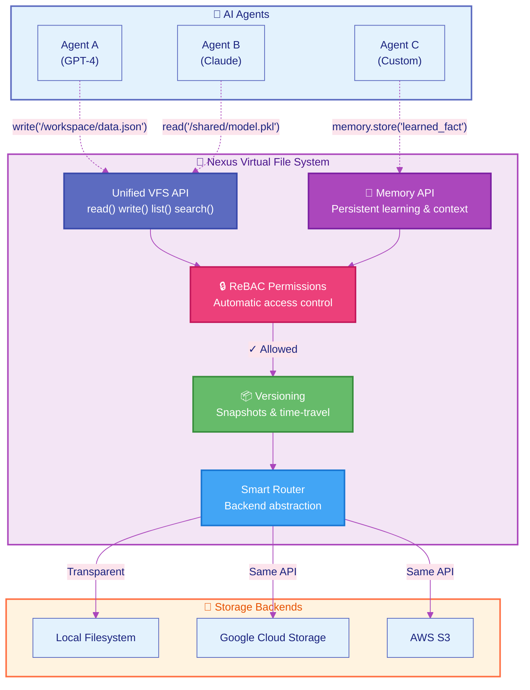

---
hide:
  - navigation
  - toc
---

<div class="hero-section">
  <div class="hero-content">
    <h1 class="hero-title">Nexus</h1>
    <p class="hero-subtitle">The AI-Native Distributed Filesystem</p>
    <p class="hero-description">Build production AI agents with enterprise-grade context, permissions, and multi-tenancy out of the box.</p>
    <div class="hero-buttons">
      <a href="getting-started/quickstart/" class="md-button md-button--primary hero-cta">
        Get Started 🚀
      </a>
      <a href="https://github.com/nexi-lab/nexus" class="md-button hero-secondary">
        View on GitHub
      </a>
    </div>
  </div>
</div>

## Quick Start in 30 Seconds

=== "Python SDK"

    ```python
    # Install
    pip install nexus-ai-fs

    # Use it
    import nexus

    # Just works - no auth needed in embedded mode
    nx = nexus.connect(config={"data_dir": "./nexus-data"})

    # Write and read files
    nx.write("/hello.txt", b"Hello, Nexus!")
    content = nx.read("/hello.txt")
    print(content.decode())  # "Hello, Nexus!"
    ```

=== "CLI"

    ```bash
    # Install
    pip install nexus-ai-fs

    # Initialize workspace
    nexus init ./my-project

    # Use with server (see Server Mode tab)
    export NEXUS_URL=http://localhost:8080
    export NEXUS_API_KEY=your-key
    nexus write /workspace/hello.txt "Hello from CLI!"
    nexus cat /workspace/hello.txt
    ```

=== "Server Mode"

    ```bash
    # Start server with authentication
    nexus serve --host 0.0.0.0 --port 8080

    # Connect from Python
    import nexus
    nx = nexus.connect(
        remote_url="http://localhost:8080",
        api_key="your-api-key"
    )
    nx.write("/workspace/hello.txt", b"Remote write!")
    ```

## How It Works



<div class="benefits-grid" markdown>

<div class="benefit-card" markdown>

### 🎯 One API

Agents use simple file operations, regardless of where data lives. No cloud SDKs to learn.

</div>

<div class="benefit-card" markdown>

### 🔒 Built-in Security

Every operation checks permissions automatically. Google Zanzibar-style ReBAC included.

</div>

<div class="benefit-card" markdown>

### 💾 Agent Memory

Persistent learning across sessions. Agents remember context and improve automatically.

</div>

<div class="benefit-card" markdown>

### 📦 Versioning

Time-travel debugging with snapshots. Roll back to any point in history instantly.

</div>

<div class="benefit-card" markdown>

### 🔄 Backend Flexibility

Switch from local to cloud without changing agent code. Zero vendor lock-in.

</div>

<div class="benefit-card" markdown>

### 🚀 Production Ready

Multi-tenancy, workspace isolation, and complete audit trails out of the box.

</div>

</div>

## 📚 Learn by Example

<div class="grid cards" markdown>

-   :material-file-document:{ .lg .middle } __File Operations__

    ---

    Master read, write, copy, move, and delete with optimistic concurrency control.

    [:octicons-arrow-right-24: View Example](examples/file-operations.md)

-   :material-folder:{ .lg .middle } __Directory Operations__

    ---

    Create hierarchies with automatic permission inheritance.

    [:octicons-arrow-right-24: View Example](examples/directory-operations.md)

-   :material-shield-lock:{ .lg .middle } __Permission Management__

    ---

    Fine-grained access control with Google Zanzibar-style ReBAC.

    [:octicons-arrow-right-24: View Example](examples/permissions.md)

-   :material-application:{ .lg .middle } __Workspace & Sessions__

    ---

    Build multi-tenant apps with workspace isolation and session tracking.

    [:octicons-arrow-right-24: View Example](examples/workspace-session.md)

</div>

<div class="cta-section">
  <p class="cta-description">Each example includes interactive demos, complete code snippets, and runnable shell scripts.</p>
  <div class="cta-buttons">
    <a href="examples/" class="md-button md-button--primary cta-large">View All Examples →</a>
    <a href="api/" class="md-button cta-large">API Reference</a>
  </div>
</div>

## What Makes Nexus Different?

<div class="comparison-table" markdown>

| Feature | Traditional FS | Object Storage | **Nexus** |
|---------|---------------|----------------|----------|
| **AI Context Preservation** | ❌ | ❌ | ✅ |
| **Semantic Search** | ❌ | ❌ | ✅ |
| **Built-in Permissions** | 🟡 Basic | 🟡 Basic | ✅ Advanced ReBAC |
| **Multi-Tenancy** | ❌ | 🟡 Manual | ✅ Native |
| **Time Travel** | ❌ | 🟡 Versioning | ✅ Full History |
| **Distributed Mode** | ❌ | ✅ | ✅ |
| **Type Safety** | ❌ | ❌ | ✅ |
| **Embedded Mode** | ✅ | ❌ | ✅ |

</div>

<div class="footer-links" markdown>

<div class="footer-grid" markdown>

<div markdown>
**Resources**

- [Documentation](getting-started/quickstart.md)
- [API Reference](api/api.md)
- [Examples](https://github.com/nexi-lab/nexus/tree/main/examples)
- [Changelog](https://github.com/nexi-lab/nexus/releases)
</div>

<div markdown>
**Community**

- [GitHub](https://github.com/nexi-lab/nexus)
- [Issues](https://github.com/nexi-lab/nexus/issues)
- [Discussions](https://github.com/nexi-lab/nexus/discussions)
- [Slack](https://nexus-community.slack.com)
</div>

<div markdown>
**More**

- [PyPI Package](https://pypi.org/project/nexus-ai-fs/)
- [Contributing](development/development.md)
- [License](https://github.com/nexi-lab/nexus/blob/main/LICENSE)
- [Security](https://github.com/nexi-lab/nexus/security)
</div>

</div>

</div>
