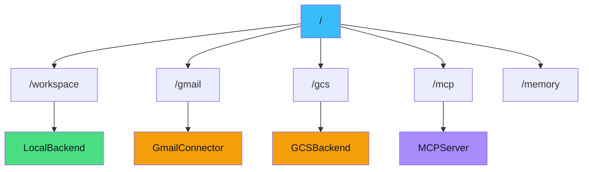
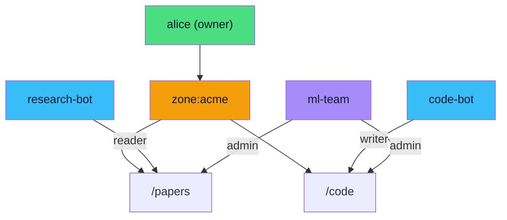
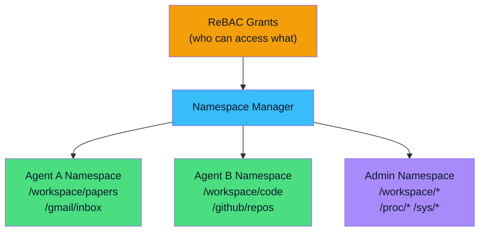
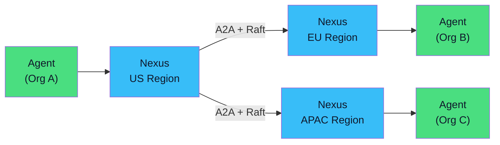
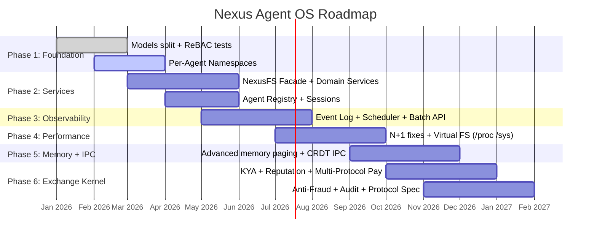

# Nexus

<p class="text-2xl" style="color: #475569;">The Operating System for AI Agents</p>

<div class="mt-6 text-lg" style="color: #64748b;">
407K lines of code · Python + Rust
<br/>
Open Source · Apache 2.0 · github.com/nexi-lab/nexus
</div>

<!-- Global Styles -->
<style>
:root {
  --slidev-theme-primary: #2563eb;
}
.slidev-layout {
  background: #ffffff;
  color: #1e293b;
  font-size: 0.65em;
  padding: 0.4rem 1.4rem !important;
}
.slidev-page .slidev-layout {
  overflow: hidden;
}
h1 {
  color: #2563eb !important;
  font-size: 1.3em !important;
  margin-bottom: 0.05em !important;
  margin-top: 0 !important;
}
h2 {
  color: #475569 !important;
  font-size: 1em !important;
}
h3 {
  color: #7c3aed !important;
  font-size: 0.82em !important;
  margin-top: 0.05em !important;
  margin-bottom: 0 !important;
}
a {
  color: #2563eb !important;
}
p, li {
  font-size: 0.8em;
  line-height: 1.15;
  margin: 0.01em 0;
}
ul, ol {
  margin: 0.02em 0;
  padding-left: 1em;
}
pre {
  font-size: 0.65em !important;
  padding: 0.1em 0.2em !important;
  margin: 0.05em 0 !important;
  line-height: 1.15 !important;
}
code {
  background: #f1f5f9 !important;
  color: #2563eb !important;
  font-size: 0.85em;
}
.today {
  color: #16a34a;
  font-weight: bold;
}
.next {
  color: #2563eb;
  font-weight: bold;
}
.accent {
  color: #7c3aed;
}
table {
  font-size: 0.65em;
}
table td, table th {
  padding: 0.05em 0.3em !important;
}
th {
  color: #2563eb !important;
  background: #f1f5f9 !important;
}
td {
  border-color: #e2e8f0 !important;
}
blockquote {
  border-left-color: #2563eb !important;
  background: #f8fafc !important;
  margin: 0.05em 0;
  padding: 0.1em 0.4em;
}
.mermaid {
  transform: scale(0.45);
  transform-origin: top center;
  margin: -0.5em 0 -2.5em 0;
}
.grid {
  gap: 0.3rem !important;
}
</style>

---
transition: fade
---

# The Agent Fragmentation Problem

<div class="grid grid-cols-2 gap-8 mt-2">
<div>

### 2026: Agents Are Everywhere

<v-clicks>

- LangChain agents, CrewAI teams, AutoGen groups, Dify workflows
- Each agent reinvents storage, memory, permissions, tools
- No shared infrastructure between frameworks
- No way for agents to safely collaborate

</v-clicks>

</div>
<div>

### What's Missing?

<v-clicks>

- **Memory** disappears between sessions
- **Permissions** are all-or-nothing
- **Storage** is framework-specific
- **Communication** between agents? Good luck.
- **Resource accounting**? Nonexistent.

</v-clicks>

</div>
</div>

<v-click>

<div class="mt-3 text-center text-xl" style="color: #f59e0b;">
Every agent framework today builds on bare metal. There is no operating system.
</div>

</v-click>

<!--
Slide 2: The Problem
Duration: 2 minutes
Build each bullet with v-click for pacing.
The punchline: "There is no operating system" lands after all pain points.
-->

---
transition: fade
---

# Why 40% of Agent Projects Fail

<div class="grid grid-cols-2 gap-8 mt-2">
<div>

### Gartner Research (2025)

<v-clicks>

- **40%** of AI agent projects **abandoned by 2027**
- **5% → 40%** enterprise apps with agentic AI (2025→2028)
- Reason: lack of infrastructure, not models

</v-clicks>

<v-click>

### The Infrastructure Gap

| What They Build | What They Need |
|-----------------|----------------|
| Prompt chains | Persistent memory |
| API wrappers | Permission system |
| Demo agents | Production isolation |
| Single-agent | Multi-agent coordination |

</v-click>

</div>
<div>

<v-click>

### Where Projects Die

```
Week 1:  "Demo works!" ✓
Week 4:  "Need memory" — custom store
Week 8:  "Need perms" — bolt on RBAC
Week 12: "Multi-agent" — rewrite all
Week 16: "Too complex" — canceled
```

Every team rebuilds: storage, permissions, memory, coordination, billing. **This is an OS.**

</v-click>

</div>
</div>

---
layout: two-cols
transition: fade
---

# 1991 → 2026

<div class="mt-4">

| | **1991** | **2026** |
|---|---|---|
| Problem | Programs need shared infra | Agents need shared infra |
| Solution | Operating System | **Agent Operating System** |

</div>

<v-clicks>

| OS Concept | Linux | Nexus |
|---|---|---|
| Filesystem | VFS + ext4 | VFS + mount table |
| Permissions | Users/groups/caps | Relationship-Based AC |
| Memory | Virtual memory + MMU | 6-layer memory paging |
| Scheduling | Process scheduler | Agent request scheduler |
| Isolation | Namespaces + cgroups | Per-agent namespaces |
| IPC | Pipes, sockets | VFS paths (/ipc/*) |
| Drivers | Kernel modules | MCP servers |
| Package mgr | apt/rpm | Skills registry |

</v-clicks>

::right::

<div class="mt-8 ml-8">

<v-click>

```
1991:
 Word, Excel → each own disk/mem
      ↓ Operating System ↓
 Shared FS + memory + perms

2026:
 LangChain, CrewAI → each own store
      ↓ Agent OS (Nexus) ↓
 Shared VFS + memory + perms
```

</v-click>

</div>

<!--
Slide 3: AHA MOMENT #1 — The 1991 Parallel
Duration: 3 minutes
The table appears row by row (v-clicks). Each row reinforces the analogy.
This is the thesis statement of the entire talk.
-->

---

# What is Nexus?

<div class="text-lg mt-2 mb-4" style="color: #64748b;">
A virtual filesystem that unifies files, databases, APIs, and SaaS tools into one path-based API for AI agents.
</div>

<div class="grid grid-cols-3 gap-6">

<div class="p-4 rounded-lg" style="background: #f1f5f9;">
<h3>Access Layer</h3>
<v-click>

- CLI (`nexus cat /data/report.csv`)
- Python SDK (`nx.read("/workspace/...")`)
- REST API (`POST /api/nfs/read`)
- MCP Server (14 tools)

</v-click>
</div>

<div class="p-4 rounded-lg" style="background: #f1f5f9;">
<h3>Runtime Modules</h3>
<v-click>

- Workspaces & Files
- Agent Memory (semantic)
- Workflows & Automation
- Skills & Sandbox
- Semantic Search

</v-click>
</div>

<div class="p-4 rounded-lg" style="background: #f1f5f9;">
<h3>Infrastructure</h3>
<v-click>

- ReBAC Permission Engine
- OAuth & Authentication
- Tiger Cache (Roaring bitmaps)
- Connectors (13 backends)
- Raft Consensus (Rust)

</v-click>
</div>

</div>

<v-click>
<div class="mt-2 text-center text-lg">
<span class="today">Humans manage context.</span> <span class="next">Agents operate within it.</span>
</div>
</v-click>

<!--
Slide 4: What is Nexus — Overview
Duration: 2 minutes
Three columns reveal progressively. Sets up the architecture deep-dive.
-->

---

# Design Principles

<div class="grid grid-cols-2 gap-8 mt-2">

<div>

### Everything is a File

<v-click>

```
/workspace/project/   → Local files
/gmail/inbox/         → Gmail messages
/gdrive/shared/       → Google Drive
/s3/data-lake/        → AWS S3
/mcp/github/          → MCP tools
/memory/agent-1/      → Agent memory
```

One API. One permission model. One search.

</v-click>

</div>

<div>

### The Protocol IS the Contract

<v-click>

```python
# ANY HTTP client is a Nexus agent
content = nx.read("/workspace/report.csv")
nx.write("/workspace/summary.md", result)
nx.grep("revenue", "/gmail + /gdrive")
nx.memory.store("Q3 revenue was $4.2M")
```

No SDK required. No framework lock-in.

</v-click>

</div>

</div>

<!--
Slide 5: Design Principles
Duration: 2 minutes
Two core principles that make Nexus unique.
-->

---

# Three Deployment Modes

<div class="grid grid-cols-3 gap-6 mt-4">

<div class="p-3 rounded-lg text-center" style="background: #f1f5f9;">
<h3 style="color: #16a34a !important;">Embedded</h3>
<v-click>

**SQLite** + Local FS

```python
import nexus
nx = nexus.NexusFS("/data")
nx.write("/hello.txt", b"Hi!")
```

Single process, zero config.
`pip install nexus-ai-fs`

*~5 microsecond metadata*

</v-click>
</div>

<div class="p-3 rounded-lg text-center" style="background: #f1f5f9;">
<h3 style="color: #2563eb !important;">Server</h3>
<v-click>

**PostgreSQL** + pgvector

```bash
nexus serve --port 2026
# Multi-user, multi-agent
# REST API + MCP + WebSocket
```

Production deployment.
Docker Compose ready.

*Multi-tenant with ReBAC*

</v-click>
</div>

<div class="p-3 rounded-lg text-center" style="background: #f1f5f9;">
<h3 style="color: #7c3aed !important;">Distributed</h3>
<v-click>

**Raft Consensus** + Federation

```
Node 1 ←→ Node 2 ←→ Node 3
     Rust Raft (~5μs PyO3)
     Zone = Consensus Domain
```

Multi-region, fault-tolerant.
Full/Witness state machines.

*Shipped: Rust Raft + redb KV*

</v-click>
</div>

</div>

<!--
Slide 6: Deployment Modes
Duration: 1.5 minutes
Shows Nexus scales from embedded to distributed.
-->

---

# Core 1: Virtual Filesystem

<div class="grid grid-cols-2 gap-8 mt-2">
<div>

### VFS Mount Table (like Linux)



</div>
<div>

<v-clicks>

### PathRouter: Longest-Prefix Match

```python
# Mount table → Resolution:
read("/workspace/project/file.txt")
#  → LocalBackend.read("project/file.txt")

read("/gmail/inbox/latest")
#  → GmailConnector.read("inbox/latest")
```

### Content-Addressable Storage
- SHA-256 dedup + reference counting
- ComposeFS-style overlay workspaces
- Automatic content versioning

</v-clicks>

</div>
</div>

<!--
Slide 7: VFS Architecture
Duration: 2 minutes
The mermaid diagram is the visual anchor. Code shows how it actually works.
-->

---

# Core 2: ReBAC Permissions

<div class="grid grid-cols-2 gap-8 mt-2">
<div>

### Relationship-Based Access Control

<v-clicks>

```
(agent:research-bot, reader, /workspace/papers)
(agent:code-bot,     writer, /workspace/code)
(team:ml-team,       admin,  /workspace/ml-*)
(user:alice,         owner,  zone:acme-corp)
```

**Zone Isolation:** Resources scoped by `zone_id`. Cross-zone requires explicit grants. Recursive groups + wildcards.

</v-clicks>

</div>
<div>



<v-click>

### What No Other Framework Has
- 14,000+ LOC permission engine
- Sub-ms Tiger cache + audit trail
- GDPR-compliant data portability

</v-click>

</div>
</div>

<!--
Slide 8: ReBAC Permissions
Duration: 2 minutes
The ReBAC graph is a powerful visual.
-->

---

# Core 3: Agent Memory

<div class="mt-4">

### 6-Layer Cognitive Memory (~48K LOC)

<div class="grid grid-cols-2 gap-4">
<div>

<v-clicks>

| Layer | Function |
|-------|----------|
| **3-Tier Paging** | Main → Recall → Archival |
| **Consolidation** | Semantic + temporal clustering |
| **Hierarchy** | Atoms → clusters → abstracts |
| **ACE Learning** | Trajectory → reflection → playbook |
| **Knowledge Graph** | Entity extraction + n-hop traversal |
| **Bi-Temporal** | Valid/invalid timestamps + versioning |

</v-clicks>

</div>
<div>

<v-click>

**Beyond basic memory paging:**
- Importance decay (0.95^days)
- Cross-agent memory sharing
- ReBAC permissions per memory
- CAS dedup + non-destructive versioning
- Manual approval workflows
- NER, coreference resolution

</v-click>

</div>
</div>
</div>

<!--
Slide 9: Agent Memory
Duration: 2 minutes
The 6-layer architecture is a key differentiator from basic memory paging.
-->

---

# Core 4: Semantic Search

<div class="grid grid-cols-2 gap-8 mt-2">
<div>

### 18-Module Search Engine (13K LOC)

<v-clicks>

| Mode | Engine |
|------|--------|
| **Keyword** | BM25S (500x faster) |
| **Semantic** | 5 embedding providers |
| **Hybrid** | RRF / Weighted fusion |
| **Graph** | Dual-level entity+relation retrieval |
| **Code** | Trigram code search |

</v-clicks>

</div>
<div>

<v-clicks>

### Query Intelligence

- **LLM Expansion**: LEX / VEC / HYDE strategies
- **Query Router**: Auto strategy selection
- **Cross-encoder Reranking** for precision
- **Hot Search Daemon**: Sub-50ms, pre-warmed
- **Mobile/Edge**: GGUF, FastEmbed support
- **Entropy-aware Chunking** + adaptive depth

### The `grep everything` Moment
One API searches files, Gmail, Drive, S3, MCP, and memory.

</v-clicks>

</div>
</div>

<!--
Slide 10: Semantic Search
Duration: 1.5 minutes
The pipeline diagram shows sophistication without complexity.
-->

---

# Core 5: Skills System

<div class="grid grid-cols-2 gap-8 mt-2">
<div>

### Agent Capabilities as Packages (12K LOC)

<v-click>

```markdown
# Summarizer v2.1
trigger: "summarize {input}"
steps: read → llm → write
governance: { approval: required }
```

**Three-tier hierarchy:** Personal → Zone → System

</v-click>

<v-click>

### Why Skills Matter
- **Versioned** — rollback if broken
- **Portable** — MCP mount/export native
- **Governed** — approval workflows
- **Composable** — skills call skills

</v-click>

</div>
<div>

<v-click>

### Multi-Format Export

| From | To |
|------|-----|
| SKILL.md | LangGraph Tool |
| SKILL.md | MCP Server |
| SKILL.md | CLI Command |
| SKILL.md | REST Endpoint |

One format, export anywhere. No framework lock-in.

</v-click>

</div>
</div>

<!--
Slide 11: Skills System
Duration: 1.5 minutes
The export diagram shows vendor neutrality.
-->

---

# Core 6: Connectors & Sandbox

<div class="grid grid-cols-2 gap-8 mt-2">
<div>

### Universal Connectors (Device Drivers)

<v-click>

| Connector | Mount Path |
|-----------|-----------|
| Local FS | `/workspace` |
| GCS / S3 | `/gcs` `/s3` |
| Gmail / Drive | `/gmail` `/gdrive` |
| Slack / X | `/slack` `/x` |
| MCP Servers | `/mcp/*` |
| Custom | `/custom/*` |

All expose the same `read/write/list/grep` interface. 13 connectors in production.

</v-click>

</div>
<div>

### Sandboxed Code Execution

<v-click>

```python
result = nx.sandbox.execute(
    code="import pandas as pd\n...",
    language="python", timeout=30)
```

**Providers:** Docker (local), E2B (cloud)
**Security:** Network isolation, resource limits, FUSE namespace mounts, audit logging

</v-click>

</div>
</div>

<!--
Slide 12: Connectors & Sandbox
Duration: 1.5 minutes
The connector table shows breadth. Sandbox shows safety.
-->

---

# Core 7: Agent Identity (KYA)

<div class="grid grid-cols-2 gap-8 mt-2">
<div>

### Know Your Agent — The Agent KYC

<v-clicks>

- Non-human identities outnumber humans **96:1**
- a16z: identity is **#1 missing primitive** for agent commerce

| Component | Function |
|-----------|----------|
| **Ed25519 Keys** | Cryptographic agent identity |
| **Web Bot Auth** | RFC 9421 HTTP signing (Cloudflare/Visa) |
| **Digital Passport** | Tamper-proof credential bundle (JWT) |
| **ERC-8004 Bridge** | On-chain identity verification |

</v-clicks>

</div>
<div>

<v-click>

### How It Works

```
Agent provisioning:
  1. Generate Ed25519 key pair
  2. Create Digital Agent Passport (DAP)
  3. Store in /.identity/ namespace
  4. Sign all outbound requests (RFC 9421)

Verification (<75ms):
  Inbound request → Signature check
  → Passport validation → ReBAC grant
```

Built on: `agent_registry.py` + `agent_provisioning.py` + NexusPay wallet

</v-click>

</div>
</div>

---

# The Control Panel

<div class="grid grid-cols-2 gap-8 mt-2">
<div>

### Human Oversight Dashboard

<v-clicks>

- **Permission Control** — Visual ReBAC editor
- **Audit Trails** — Every action logged
- **Memory Inspector** — View/edit agent memories
- **Budget Dashboard** — Cost tracking per agent

</v-clicks>

</div>
<div>

<v-click>

### Why This Matters

```
Without Nexus:
  Full access. No audit. Memory vanishes.
With Nexus:
  [x] Agent sees only /workspace/project-x
  [x] Every read/write logged
  [x] Memory persists across sessions
  [x] Budget limits prevent runaway costs
```

Human-in-the-loop at the infrastructure level.

</v-click>

</div>
</div>

<!--
Slide 13: Control Panel
Duration: 1.5 minutes
This is the business value slide — shows human oversight.
-->

---

# Framework Integrations

<div class="grid grid-cols-4 gap-4 mt-2">

<div class="p-2 rounded-lg text-center" style="background: #f1f5f9;">
<v-click>

### CrewAI
```python
nx = connect(url="...", key="...")
agent = Agent(role="Researcher",
    tools=[nx.as_tool()])
```

</v-click>
</div>

<div class="p-2 rounded-lg text-center" style="background: #f1f5f9;">
<v-click>

### LangGraph
```python
nx = connect(url="...", key="...")
graph.add_node("read", nx.read)
graph.add_node("write", nx.write)
```

</v-click>
</div>

<div class="p-2 rounded-lg text-center" style="background: #f1f5f9;">
<v-click>

### Claude SDK
```python
tool = {"name": "nexus_read",
    "input": {"path": "/data/*"}}
```

</v-click>
</div>

<div class="p-2 rounded-lg text-center" style="background: #f1f5f9;">
<v-click>

### OpenAI Agents
```python
# Own namespace + memory
nx = connect(ns="/agent-1")
```

</v-click>
</div>

</div>

<v-click>
<div class="mt-2 text-center">
Nexus is the infrastructure layer. <span class="accent">Any framework. Same API.</span>
</div>
</v-click>

<!--
Slide 14: Framework Integrations
Duration: 1 minute
Shows Nexus is framework-agnostic. The punchline reinforces the OS analogy.
-->

---
layout: center
---

<div class="text-center">
<h1 class="text-5xl">Agent OS: What's Next</h1>
<p class="text-xl mt-4" style="color: #64748b;">
<span class="today">Built Today</span> → <span class="next">Building Tomorrow</span>
</p>
</div>

<!--
Slide 15: Section Divider
Duration: 5 seconds
Transition into the Agent OS vision section.
-->

---

# The Key Insight: Agents Are Not Processes

<div class="grid grid-cols-2 gap-8 mt-2">
<div>

### A Paradigm Shift

<v-clicks>

- Linux processes: **run continuously**, CPU-bound
- AI agents: **burst-wait-burst**, I/O-bound, external
- Nexus provides **protocol and resources**, not execution

</v-clicks>

<v-click>

| Property | Linux Process | AI Agent |
|----------|--------------|----------|
| Execution | Continuous | Burst-wait-burst |
| Bound by | CPU/Memory | I/O (API calls) |
| Identity | PID (ephemeral) | API key (persistent) |
| Location | On the machine | Anywhere |

</v-click>

</div>
<div>

<v-click>

### What This Means

```
Linux doesn't care if it's nginx or vim.
Nexus doesn't care if it's LangChain or curl.

The protocol IS the contract:
  Authenticate → Read → Write → Remember

Any HTTP client is a Nexus agent.
```

</v-click>

</div>
</div>

<!--
Slide 16: Agents Are Not Processes
Duration: 2 minutes
This is one of the research doc's most important insights (Part 9).
Nexus defines what agents CAN DO, not what agents ARE.
-->

---

# Per-Agent Namespaces

<div class="grid grid-cols-2 gap-8 mt-2">
<div>

### Plan 9-Style Mount Tables

<v-click>

```
Agent A: /workspace/papers  /gmail/inbox
Agent B: /workspace/code    /github/repos
Admin:   /workspace/*       /proc/agents
```

Same system. Different views. **Unmounted = invisible, not denied.**

</v-click>

</div>
<div>

<v-click>

### Namespace = Security Model



<div class="mt-2">

- <span class="today">Today:</span> PathRouter + ScopedFilesystem + ReBAC
- <span class="next">Next:</span> Per-agent mount tables with dcache

</div>

</v-click>

</div>
</div>

<!--
Slide 16: AHA MOMENT #2 — Per-Agent Namespaces
Duration: 2 minutes
The namespace concept is the "Linux doesn't care if it's nginx or vim" moment.
Agent can't even NAME a resource outside its namespace.
-->

---

# Agent Registry & Lifecycle

<div class="grid grid-cols-2 gap-8 mt-2">
<div>

### Agent State Machine

<v-click>

```
UNKNOWN → CONNECTED → IDLE → SUSPENDED → TERMINATED
              ↑          |
              └── request ┘
         ERROR ← failure
```

### AgentRecord

| Field | Purpose |
|-------|---------|
| `agent_id` | Identity ("data-analyst") |
| `zone_id` | Tenant isolation |
| `state` | CONNECTED, IDLE, SUSPENDED |
| `grants` | ReBAC → Namespace |
| `budget` | Token/cost limits (NexusPay) |

</v-click>

</div>
<div>

<v-click>

### Key Design Decision
Nexus tracks agent *identity and access*.
**Agents are external. The protocol is the contract.**

</v-click>

</div>
</div>

<!--
Slide 17: Agent Registry
Duration: 2 minutes
The state machine diagram is clear and informative.
-->

---

# Transactional Event Log

<div class="grid grid-cols-2 gap-8 mt-2">
<div>

### DBOS Pattern: Everything is a Transaction

<v-click>

```python
# Today: separate txns (crash = lost audit)
store.write(path, content)   # Tx 1
log.record("write", path)    # Tx 2

# Tomorrow: single DB transaction
with db.transaction() as tx:
    store.write(path, content, tx)
    event_log.record("write", path, tx=tx)
    # ← Atomic: both succeed or both fail
```

</v-click>

</div>
<div>

<v-clicks>

### What This Enables

- **Audit trail** — Every agent action in immutable log
- **Time travel** — "What did agent X do between 2-3pm?"
- **Replay** — Recreate system state from events
- **Compliance** — GDPR, SOC2 audit requirements

### Built on Existing Foundation

- <span class="today">Today:</span> `OperationLogModel` + file versioning
- <span class="next">Next:</span> Co-transactional VFS ops + event logging

</v-clicks>

</div>
</div>

<!--
Slide 18: Event Log
Duration: 1.5 minutes
Code comparison shows the concrete improvement.
-->

---

# Time Travel & Knowledge Graph

<div class="grid grid-cols-2 gap-8 mt-2">
<div>

### Time Travel Debugging

<v-click>

```python
versions = nx.versions("/workspace/app.py")
nx.restore("/workspace/app.py", version=2)
nx.diff("/workspace/app.py", v1=2, v2=3)
nx.audit(path="/workspace/*", since="24h")
```

CAS means nothing is lost. Every write = immutable snapshot.

</v-click>

</div>
<div>

### Knowledge Graph

<v-click>

```python
nx.knowledge.query("revenue Q3")
# → Entities, relations, sources
# Files ←→ Memories ←→ Entities
```

- Entity extraction from agent interactions
- Automatic relationship mapping
- Cross-workspace knowledge linking

</v-click>

<v-click>

<span class="today">Both shipped today.</span> Not on a roadmap.

</v-click>

</div>
</div>

---

# Request Scheduler & Batch API

<div class="grid grid-cols-2 gap-8 mt-2">
<div>

### io_uring-Inspired Batch Operations

<v-click>

```python
batch = nexus.create_batch()
batch.submit(op="read", path="/data/model.bin")
batch.submit(op="write", path="/out.json",
    content=result)
batch.submit(op="search", query="embedding")
results = batch.drain()  # One roundtrip
```

</v-click>

</div>
<div>

<v-clicks>

### 4-Layer Priority Scheduler (Shipped)

| Layer | Function |
|-------|----------|
| **Base priority** | 0-4 levels (critical→background) |
| **Boost** | User-facing requests elevated |
| **Aging** | Stale tasks rise in priority |
| **Anti-starvation** | Low-priority tasks guaranteed |

- <span class="today">Today:</span> Rust TaskEngine (fjall LSM) + 4-layer scheduler + NexusPay credits
- <span class="next">Next:</span> Pluggable policies + batch API

</v-clicks>

</div>
</div>

<!--
Slide 19: Scheduler
Duration: 1.5 minutes
The batch API code is concrete and impressive.
-->

---

# VFS-Based Agent Communication

<div class="mt-4">

### Agents Talk Through the Filesystem

| Pattern | How |
|---------|-----|
| **Point-to-Point** | `write("/ipc/agent-b/inbox", task)` → `read("/ipc/own/inbox")` |
| **Shared State** | `write("/shared/team/state", data)` — CRDTs merge automatically |
| **Pub/Sub** | `subscribe("/ipc/own/*")` — WebSocket push notifications |
| **Authorization** | Not in namespace → cannot send. Structural isolation. |

</div>

<v-click>
<div class="mt-2 text-center text-lg">
No new IPC protocol needed. <span class="accent">read() and write() are already IPC.</span>
</div>
</v-click>

<!--
Slide 20: VFS-based IPC
Duration: 1.5 minutes
The ASCII diagram from the research doc. Shows elegance of the VFS approach.
-->

---
layout: center
---

<div class="text-center">
<h1 class="text-5xl">Business Use Cases</h1>
<p class="text-xl mt-4" style="color: #64748b;">
$5.25B agent market today — $52.62B by 2030 (Deloitte)
</p>
</div>

---

# The Protocol Trinity

<div class="grid grid-cols-3 gap-4 mt-2">

<div class="p-2 rounded" style="background: #f1f5f9;">
<h3 style="color: #16a34a !important;">A2A — Discovery</h3>
<v-click>

Google A2A (Linux Foundation, 150+ orgs)

- **Agent Cards** for discovery
- Tyson, Microsoft in production
- Nexus: `/.well-known/agent.json`

</v-click>
</div>

<div class="p-2 rounded" style="background: #f1f5f9;">
<h3 style="color: #2563eb !important;">MCP — Tools</h3>
<v-click>

Anthropic Model Context Protocol

- **97M+/mo** SDK downloads
- **$10.3B** projected market
- Nexus: 14 MCP tools native

</v-click>
</div>

<div class="p-2 rounded" style="background: #f1f5f9;">
<h3 style="color: #7c3aed !important;">x402/AP2 — Payments</h3>
<v-click>

Coinbase, Visa, Mastercard

- **$24M** via x402 in 8 months
- Mastercard first agentic payment
- NexusPay: x402 + USDC native

</v-click>
</div>

</div>

<v-click>
<div class="mt-2 text-center">
<span class="accent">Only Agent OS</span> implementing all three protocols as kernel primitives.
</div>
</v-click>

---

# Use Case 1: Enterprise Knowledge Worker

<div class="grid grid-cols-2 gap-4 mt-2">
<div>

### The Wells Fargo Pattern

<v-click>

35K bankers access 1,700 procedures in **30s** (was 10 min).

```python
nexus grep "compliance procedure 1042" \
    /sharepoint /confluence /gdrive /email
# → unified results across all backends
```

### Nexus Advantage
- **VFS**: One search across all enterprise data
- **Memory**: Remembers past queries across sessions
- **ReBAC**: Agent only sees authorized data

</v-click>

</div>
<div>

<v-click>

### Market Context

- **$85K/month** avg enterprise AI spend
- **45%+** enterprises use agentic orchestration by 2026

</v-click>

</div>
</div>

---

# Use Case 2: Financial Compliance Multi-Agent Team

<div class="grid grid-cols-2 gap-4 mt-2">
<div>

### ReBAC-Isolated Agent Teams

<v-click>

| Agent | Access | Action |
|-------|--------|--------|
| Monitor | `/transactions` (reader) | Flags suspicious tx |
| Analyst | `/cases` + `/reports` (rw) | Investigates flags |
| Action | `/accounts` + `/alerts` (admin) | Freezes accounts |

Each agent isolated in `zone:acme-compliance`.

</v-click>

</div>
<div>

<v-click>

### Why This Needs an OS

Nexus isolates at the **infrastructure** level:

- **Namespace** — Monitor agent cannot freeze accounts
- **Audit** — Every action logged per agent
- **Budget** — Spending limits via NexusPay
- **Oversight** — Compliance officer sees all via /proc

Also: procurement, order-to-cash, KYC/AML

</v-click>

</div>
</div>

---

# Use Case 3: Deploy an Agent Fleet (B2A)

<div class="grid grid-cols-2 gap-4 mt-2">
<div>

### Business-to-Agent Workflow

<v-click>

```python
# Register fleet
for role in ["researcher", "analyst"]:
    nx.agents.register(name=f"fin-{role}",
        namespace=f"/finance/{role}", budget=1000)
# Discover via A2A
cards = nx.agents.discover(
    capability="financial-analysis")
# Monitor + budget
nx.pay.set_limit("fin-*", daily=500)
```

</v-click>

</div>
<div>

<v-click>

### Enterprise Sales Pitch

| What | How |
|------|-----|
| Deploy | Agent Registry + state machine |
| Isolate | Per-agent namespaces |
| Spend | NexusPay budget enforcement |
| Monitor | Virtual /proc filesystem |

### Per-Seat → Per-Agent Pricing

Salesforce: $0.10/action · Copilot: $0.04/req · **92%** use mixed pricing

</v-click>

</div>
</div>

---

# Use Case 4: Cross-Org Federation

<div class="grid grid-cols-2 gap-4 mt-2">
<div>

### Federated Agent Communication

<v-click>



</v-click>

<v-click>

### Supply Chain Example
- **Tyson Foods** ↔ **distributor** agent data sharing
- Capability tokens for cross-instance auth
- Zone-level GDPR Article 20 compliance

</v-click>

</div>
<div>

<v-click>

### Federation Features (Shipped)

- **Rust Raft** — production impl, ~5μs latency via PyO3
- **Full/Witness** state machines (redb KV store)
- **Zone = Consensus Domain** — per-zone sharding
- **DT_MOUNT** — cross-zone path resolution
- **Capability Tokens** — cross-instance auth

</v-click>

</div>
</div>

---

# Use Case 5: Developer Platform

<div class="grid grid-cols-2 gap-4 mt-2">
<div>

### Code Agent + Sandbox + Skills

<v-click>

```python
nx.write("/workspace/app/main.py", code)
nx.restore("/workspace/app/main.py", version=3)
nx.sandbox.execute(code=test_code,
    language="python", timeout=30)
nx.skills.publish(name="code-reviewer",
    version="1.0", export_formats=["mcp"])
```

</v-click>

</div>
<div>

<v-click>

### The Code Agent Loop

```
Read code → Analyze (LLM) → Write fix
    → Test in sandbox
    → Pass? → Version + publish as skill
    → Fail? → Back to Analyze
```

**Namespace-scoped FUSE mounts** — sandbox sees only agent's namespace.

</v-click>

</div>
</div>

---

# Agent Marketplace: The New App Store

<div class="grid grid-cols-2 gap-4 mt-2">
<div>

### Everyone Is Building One

<v-click>

| Platform | Scale |
|----------|-------|
| AWS AI Agents | 900+ listings |
| Salesforce AgentExchange | $900M rev / 6 months |
| Microsoft 365 Agent Store | Copilot ecosystem |
| Oracle Fusion | 100+ agents |

</v-click>

<v-click>

### Nexus = Native Marketplace

Agents **live-run** on the platform (not download-only). Skills Registry + NexusPay + ReBAC isolation.

</v-click>

</div>
<div>

<v-click>

### The Agent Economy

```
Business → Budget → Agent Fleet
Agent → Credits → Nexus (internal ledger)
Agent → Skill → Royalty · Agent → x402 → API
```

Revenue: Hosting → Usage → Marketplace (15-30%) → Payments (0.5-2%)

</v-click>

</div>
</div>

---

# Future Vision: Agentic Commerce

<div class="grid grid-cols-2 gap-4 mt-2">
<div>

### The Numbers

<v-click>

- **4,700%** growth in AI shopping searches (2024→2025)
- **23%** of Americans purchased via AI agent
- Criteo agent recs: **60% more relevant**

</v-click>

<v-click>

### How Agents Change Commerce

Traditional: Human → Search → Click → Buy
Agentic: Human → Intent → **Agent shops, compares, pays**

</v-click>

</div>
<div>

<v-click>

### Nexus as Agent Ad Network

Merchants register → Agents query → Merchants bid → Nexus takes %

### Payment Protocols

| Protocol | Backers | Status |
|----------|---------|--------|
| x402 | Coinbase | $24M processed |
| AP2 | Google, Mastercard | Open standard |
| ACP / TAP | OpenAI, Visa | Live / Pilot |

</v-click>

</div>
</div>

---
layout: center
---

<div class="text-center">
<h1 class="text-5xl">Agent Exchange Kernel</h1>
<p class="text-xl mt-4" style="color: #64748b;">
7 infrastructure layers for open agent-to-agent commerce
</p>
</div>

---

# Exchange Kernel: 7-Layer Architecture

<div class="mt-2">

```
Layer 7: Exchange Protocol    — OpenAPI + Protobuf + SDK generation
Layer 6: Audit Log            — Immutable hash-chain, Merkle proofs
Layer 5: Anti-Fraud           — Governance graphs, collusion detection
Layer 4: Spending Policies    — Budgets, approvals, rate controls
Layer 3: Reputation & Trust   — Dynamic scores, disputes, trust tiers
Layer 2: Agent Identity (KYA) — Core 7 (shipped as OS primitive)
Layer 1: Multi-Protocol Pay   — x402 + ACP + AP2, unified settlement
```

</div>

<div class="grid grid-cols-2 gap-4 mt-2">
<div>

<v-click>

### What Exists vs New

| Layer | Status |
|-------|--------|
| Multi-Protocol Pay | **90%** — x402 shipped, +ACP/AP2 |
| Agent Identity | **Core 7** — OS primitive |
| Reputation | **0%** — full build |
| Spending Policies | **20%** — rate limiter exists |
| Anti-Fraud | **10%** — HMAC only |
| Audit Log | **85%** — +payment audit |
| Exchange Protocol | **60%** — implicit API exists |

</v-click>

</div>
<div>

<v-click>

### Research-Backed

- **25+ papers** — AEX, DeepMind, Microsoft, Google
- **Collusion**: 50% → 5.6% with governance graphs
- **Identity**: non-human IDs outnumber humans **96:1**
- **Protocols**: x402 ($24M), ACP (Stripe), AP2 (Google)
- **Standards**: ERC-8004 live on Ethereum mainnet

</v-click>

</div>
</div>

---

# Exchange Kernel: Key Capabilities

<div class="grid grid-cols-2 gap-4 mt-2">
<div>

<v-clicks>

### KYA (Core 7 → Exchange)
- Identity is an OS primitive, not just exchange
- Every exchange tx verified via DAP + Ed25519
- <75ms verification feeds all 7 layers

### Reputation & Trust
- 5 dimensions: reliability, quality, latency, honesty
- Anti-gaming: weighted by reporter reputation
- Tiers: unverified → basic → trusted → premium
- Dispute resolution with evidence chain

### Multi-Protocol Settlement
- x402 + ACP (Stripe) + AP2 (Google)
- Protocol auto-detection + unified ledger
- Cross-protocol bridge (x402 ↔ ACP ↔ AP2)

</v-clicks>

</div>
<div>

<v-clicks>

### Spending Policy Engine
- Per-agent budgets: daily/weekly/monthly
- Approval chains: auto <$1, review >$10
- Velocity checks + cool-down periods
- Policy DSL: zone → group → agent inheritance

### Anti-Fraud & Anti-Collusion
- Governance graphs: collusion 50% → 5.6%
- Ring + Sybil detection on agent graph
- Real-time anomaly detection on tx streams

### Audit & Protocol
- Immutable hash-chain log + Merkle proofs
- OpenAPI 3.1 + Protobuf + SDK generation
- OTEL correlation across full tx lifecycle

</v-clicks>

</div>
</div>

---

# The Market Validates Agent OS

<div class="mt-2">

### Everyone Is Building This Layer

| Approach | Limitation |
|----------|-----------|
| Enterprise Agent Platforms | Closed source, no VFS, vendor lock-in |
| Funded Agent Infra Startups | $50M+ raised but no permission model |
| Academic Agent OS Projects | Research only, not production-ready |
| Memory-Only Frameworks | Single capability, not a full OS |
| Orchestration Frameworks | No OS primitives (VFS, ReBAC, IPC) |
| **Nexus** | **Open Source: VFS+ReBAC+Memory+Pay** |

</div>

<v-click>
<div class="mt-1">

**Only open-source** Agent OS with VFS + ReBAC + Memory + Payments. **Only one** with A2A + MCP + x402 as kernel primitives.

</div>
</v-click>

---

# Agent OS Maturity Model

<div class="mt-2">

| Layer | Industry Status | **Nexus** |
|-------|----------------|-----------|
| Filesystem | Ad hoc RAG | <span class="today">VFS + CAS + overlays</span> |
| Security | None / basic RBAC | <span class="today">ReBAC (14K LOC)</span> |
| Resources | None | <span class="today">NexusPay (x402)</span> |
| Drivers | Early MCP | <span class="today">14 MCP + 13 connectors</span> |
| Memory | Basic paging | <span class="today">6-layer (48K LOC)</span> |
| IPC | Prototypes | <span class="next">VFS + event bus</span> |
| Scheduling | Research | <span class="today">Rust TaskEngine + scheduler</span> |
| Lifecycle | Draft specs | <span class="today">Agent Registry</span> |

</div>

<v-click>

<div class="mt-2 text-center">
Only project with production <span class="today">VFS + Security + Payments + Memory + Drivers</span> simultaneously.
</div>

</v-click>

<!--
Slide 29: AHA MOMENT #3 — Maturity Model
Duration: 2 minutes
This table is the strongest differentiator. Shows the ENTIRE FIELD and where Nexus sits.
Each row tells a story. The punchline: no one else has this breadth.
-->

---

# What's Actually Built

<div class="grid grid-cols-2 gap-8 mt-2">
<div>

### Production Stats

- **407K LOC** Python + **21** Rust files (PyO3)
- **54** models, **14** MCP tools, **679 commits** / 4 months
- **300+ stars**, **187 open issues**, **30+ PRs** / 2 weeks

<v-click>

### Key Systems (Shipped)

| System | Detail |
|--------|--------|
| ReBAC Engine | 14,000+ LOC, Roaring bitmaps |
| Memory System | 6-layer cognitive, 48K LOC |
| Search Engine | 18 modules, 13K LOC |
| Task Queue | Rust TaskEngine (fjall LSM) |
| Tiger Cache | 10-100x speedup |
| NexusPay | Python + TypeScript SDK |

</v-click>

</div>
<div>

<v-click>

### Recent Velocity (Last 30 Days)

```
feat: Durable Task Queue (Rust)
feat: NexusPay TypeScript SDK
perf: Memory paging batch eviction
feat: ComposeFS overlay workspaces
feat: ACE Learning + Knowledge Graph
feat: FUSE mount (~2K LOC)
epic: Agent Exchange Kernel (7 layers)
```

Not a research project — production software.

</v-click>

</div>
</div>

---

# The Missing Layer

<div class="mt-4">

```
┌──────────────────────────────────────────────┐
│  APPLICATIONS  (your agents + workflows)      │
├──────────────────────────────────────────────┤
│  ORCHESTRATION  (CrewAI, LangGraph, AutoGen) │
├──────────────────────────────────────────────┤
│  ▶ AGENT OS (Nexus) ◀  ← YOU ARE HERE       │
│  VFS + ReBAC + Memory + Exchange + NexusPay  │
├──────────────────────────────────────────────┤
│  CLOUD  (AWS / GCP / Azure / K8s)            │
└──────────────────────────────────────────────┘
```

</div>

<v-click>
<div class="mt-2 text-center">

Nexus doesn't compete with CrewAI or LangGraph — it **powers** them.
Like Linux doesn't compete with Docker. It's the layer beneath.
</div>
</v-click>

---

# Roadmap: 6 Phases

<div class="mt-1 text-sm">



</div>

<v-click>
<div class="mt-2 text-center">

**Track A:** 16 engineering issues &middot; **Track B:** 8 Agent OS features &middot; **Track C:** 7 Exchange Kernel layers (KYA, reputation, multi-pay, policies, anti-fraud, audit, protocol)

</div>
</v-click>

<!--
Slide 31: Roadmap
Duration: 1.5 minutes
The Gantt chart shows this is planned, not hand-wavy.
-->

---

# Get Started

<div class="grid grid-cols-3 gap-6 mt-4">

<div class="p-3 rounded-lg text-center" style="background: #f1f5f9;">
<h3 style="color: #16a34a !important;">Try It Now</h3>

```bash
pip install nexus-ai-fs
```

```python
nx = nexus.connect(
    url="http://localhost:2026",
    api_key="nxk_...")
nx.write("/hello.txt", b"Hello!")
```

</div>

<div class="p-3 rounded-lg text-center" style="background: #f1f5f9;">
<h3 style="color: #2563eb !important;">Live Demo</h3>

**Live Demo Available**

Frontend + API + LangGraph

PostgreSQL + pgvector + 14 MCP tools

</div>

<div class="p-3 rounded-lg text-center" style="background: #f1f5f9;">
<h3 style="color: #7c3aed !important;">Contribute</h3>

**github.com/nexi-lab/nexus**

187 open issues · Apache 2.0
Python + Rust · Active dev

</div>

</div>

<!--
Slide 32: Get Started
Duration: 1 minute
Three paths for three audience types.
-->

---
layout: center
---

<div class="text-center">

<h1 class="text-6xl font-bold" style="color: #2563eb !important;">Nexus</h1>

<p class="text-2xl mt-6" style="color: #64748b;">The Operating System for AI Agents</p>

<div class="mt-8 text-lg" style="color: #64748b;">

`pip install nexus-ai-fs` &middot; github.com/nexi-lab/nexus

</div>

<div class="mt-8 text-xl" style="color: #334155;">

Where agents come to work.

</div>

</div>

<!--
Slide 33: Closing
Duration: 30 seconds
Mirror the opening slide. End on the tagline.
-->
