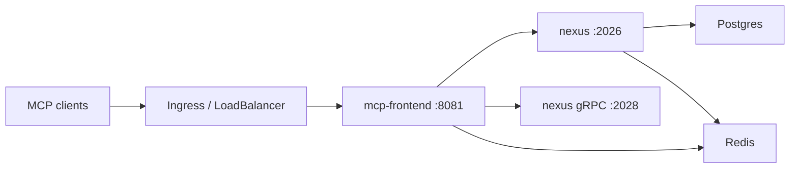

# Issue #3875 - Nexus Hub Helm Chart Design

**Date:** 2026-05-04
**Issue:** [#3875](https://github.com/nexi-lab/nexus/issues/3875) - feat: Kubernetes / Helm deployment for hub mode
**Follow-up to:** [#3784](https://github.com/nexi-lab/nexus/issues/3784) - hub mode

## Context

Issue #3784 shipped a Docker Compose reference stack for Nexus hub mode:

- `nexus`: `nexusd` RPC server on port 2026, gRPC on 2028, backed by Postgres and Redis.
- `mcp-frontend`: `nexus mcp serve --transport http` on port 8081, forwarding bearer-authenticated requests to the RPC server.
- `postgres`: `pgvector/pgvector:pg17` for auth, zones, metadata, and hub token storage.
- `redis`: `redis:7-alpine` for audit publish, hub metrics, and rate-limit storage.

The Helm chart should preserve that runtime topology rather than introduce a new hub mode. Kubernetes is packaging and operations surface only.

## Goals

- Add `charts/nexus-hub` as the first Helm chart in this repo.
- Make `helm install nexus-hub charts/nexus-hub` produce a working single-namespace hub with in-cluster Postgres and Redis by default.
- Allow production operators to point the same chart at external Postgres and Redis services.
- Expose the MCP frontend through a Service and optional Ingress with cert-manager TLS annotations.
- Provide values for `NEXUS_PROFILE`, Postgres settings, replica count, resources, persistence, image settings, service, ingress, TLS, and optional PodMonitor.
- Add `docs/hub-deploy-k8s.md` with prerequisites, install, bootstrap, upgrade, production hardening, and troubleshooting guidance.

## Non-Goals

- No database migrations or runtime code changes.
- No Kubernetes Operator or CRDs beyond optional ServiceMonitor/PodMonitor-style monitoring resources.
- No dependency on Bitnami or other Helm subcharts in the first version.
- No bundled TLS issuer. The chart can annotate Ingress for cert-manager, but cluster issuer lifecycle stays outside the chart.
- No multi-replica RPC server by default. The chart exposes replica values, but the safe default remains one RPC pod and one MCP frontend pod.

## Approach Chosen

Use first-party Helm templates for Nexus, Postgres, and Redis.

The chart defaults to an in-cluster, single-replica Postgres StatefulSet and Redis Deployment so the issue acceptance command works without extra infrastructure. Operators can disable either bundled service and provide external connection details through values.

Rejected alternatives:

- **Bitnami subcharts:** mature defaults, but adds third-party chart behavior, lockfiles, and value indirection for the first chart in this repo.
- **External-services-only:** simpler chart, but fails the one-command install requirement and is less useful as a reference deployment.

## Chart Layout

```text
charts/nexus-hub/
  Chart.yaml
  values.yaml
  README.md
  templates/
    _helpers.tpl
    NOTES.txt
    nexus-deployment.yaml
    nexus-service.yaml
    mcp-frontend-deployment.yaml
    mcp-frontend-service.yaml
    ingress.yaml
    postgres-secret.yaml
    postgres-statefulset.yaml
    postgres-service.yaml
    redis-deployment.yaml
    redis-service.yaml
    podmonitor.yaml
```

`README.md` is generated by hand for this repo, not via helm-docs, unless the project later adopts a chart documentation generator.

## Runtime Topology



The chart mirrors `docker-compose.hub.yml`:

- `nexus` container entrypoint: `nexusd`
- `nexus` args:
  - `--host 0.0.0.0`
  - `--port 2026`
  - `--profile <values.nexus.profile>`
  - `--auth-type database`
  - `--database-url $(NEXUS_DATABASE_URL)`
- `nexus` env:
  - `NEXUS_DATA_DIR=/data`
  - `NEXUS_DATABASE_URL`
  - `NEXUS_REDIS_URL`
  - `NEXUS_GRPC_BIND_ALL=true`
  - `NEXUS_GRPC_PORT=2028`
  - `NEXUS_ADVERTISE_ADDR=<release>-nexus:2028`
- `mcp-frontend` command:
  - `nexus mcp serve --transport http --host 0.0.0.0 --port 8081`
- `mcp-frontend` env:
  - `NEXUS_URL=http://<release>-nexus:2026`
  - `NEXUS_REDIS_URL`
  - `NEXUS_GRPC_ALLOW_INSECURE=true`
  - `NEXUS_MCP_REQUIRE_BEARER=true`

`mcp-frontend` must not set `NEXUS_API_KEY`.

## Values Contract

Top-level values:

```yaml
image:
  repository: ghcr.io/nexi-lab/nexus
  tag: latest
  pullPolicy: IfNotPresent

nexus:
  profile: full
  replicaCount: 1
  resources: {}
  persistence:
    enabled: true
    size: 20Gi
    storageClass: ""

mcpFrontend:
  replicaCount: 1
  resources: {}

postgres:
  internal:
    enabled: true
    image: pgvector/pgvector:pg17
    persistence:
      enabled: true
      size: 20Gi
      storageClass: ""
  auth:
    database: nexus
    username: nexus
    password: nexus
    existingSecret: ""
    existingSecretPasswordKey: password
  external:
    host: ""
    port: 5432
    database: nexus
    username: nexus
    password: ""
    existingSecret: ""
    existingSecretPasswordKey: password

redis:
  internal:
    enabled: true
    image: redis:7-alpine
    persistence:
      enabled: true
      size: 5Gi
      storageClass: ""
  external:
    url: ""
    existingSecret: ""
    existingSecretUrlKey: redis-url

service:
  type: ClusterIP
  mcpPort: 8081

ingress:
  enabled: false
  className: ""
  host: ""
  annotations: {}
  tls:
    enabled: false
    secretName: ""

podMonitor:
  enabled: false
  labels: {}
```

Password behavior:

- If Postgres is internal and no `existingSecret` is set, `postgres.auth.password` defaults to `nexus` so bare `helm install nexus-hub charts/nexus-hub` works for reference deployments.
- Production docs must instruct operators to set `postgres.auth.existingSecret` or override `postgres.auth.password` before first install.
- If external Postgres is used, the chart builds `postgresql://<user>:<password>@<host>:<port>/<database>` from values or a secret.
- If external Redis is used, `redis.external.url` or `redis.external.existingSecret` is required.
- The chart should not generate random credentials because random generation breaks repeatable `helm upgrade` unless carefully retained.

## Kubernetes Resources

### Nexus RPC Server

Use a Deployment with a PVC for `/data`. The default replica count is one because hub state is backed by Postgres but local indexes and data files still need a single-writer default until the runtime docs say otherwise. The value is exposed for advanced deployments.

Readiness and liveness probes call `GET /health` on port 2026.

### MCP Frontend

Use a separate Deployment and Service. This pod is horizontally scalable by default because it is stateless aside from Redis-backed audit/rate-limit behavior. The conservative default is one replica.

Readiness and liveness probes call `GET /health` on port 8081.

### Postgres

Internal Postgres uses a StatefulSet with `pgvector/pgvector:pg17`, a ClusterIP Service, env from Secret, and a PVC. The chart does not try to become a managed database solution; docs should recommend external managed Postgres for production.

### Redis

Internal Redis uses a Deployment plus optional PVC. It is sufficient for reference deployments and small installations. Docs should recommend managed Redis or Dragonfly for production.

### Ingress and TLS

Ingress is optional and targets the MCP frontend service. TLS is enabled by setting `ingress.tls.enabled=true`, `ingress.tls.secretName`, and cert-manager annotations such as `cert-manager.io/cluster-issuer`.

### PodMonitor

`podMonitor.enabled=true` emits a monitoring resource for scraping the Nexus `/metrics` endpoint. Because the issue says this blocks on metrics availability, keep it disabled by default and document that clusters without the Prometheus Operator CRD should leave it off.

## Documentation

Create `docs/hub-deploy-k8s.md` with:

1. Prerequisites: Kubernetes cluster, Helm 3, image access, storage class, ingress controller for public access, cert-manager for TLS.
2. Local/reference install:
   - `helm install nexus-hub charts/nexus-hub`
   - explain that the built-in password is for reference installs only
   - wait for pods
   - port-forward MCP frontend
   - create first admin token with `kubectl exec deploy/nexus-hub-nexus -- nexus hub token create --name root --admin --zone root`
3. Production install:
   - set a non-default Postgres password before first install, preferably via an existing Secret
   - external Postgres
   - external Redis
   - resource requests/limits
   - Ingress TLS with cert-manager annotations
4. Upgrade path:
   - `helm diff upgrade` if available
   - `helm upgrade nexus-hub charts/nexus-hub -f values.prod.yaml`
   - image tag pinning
   - backup Postgres before upgrades
5. Operations:
   - token lifecycle
   - health checks
   - logs
   - backup and restore
6. Troubleshooting:
   - missing Postgres password
   - pending PVCs
   - 401 without bearer
   - external Redis URL problems
   - Ingress TLS not issued

Add the page to `mkdocs.yml` under `Deployment`.

## Testing and Verification

Static checks:

- `helm lint charts/nexus-hub`
- `helm template nexus-hub charts/nexus-hub`
- `helm template nexus-hub charts/nexus-hub --set postgres.internal.enabled=false --set postgres.external.host=postgres.example.com --set postgres.external.password=secret`
- `helm template nexus-hub charts/nexus-hub --set redis.internal.enabled=false --set redis.external.url=redis://redis.example.com:6379`
- `helm template nexus-hub charts/nexus-hub --set ingress.enabled=true --set ingress.host=nexus.example.com --set ingress.tls.enabled=true --set ingress.tls.secretName=nexus-hub-tls`

If a local cluster is available:

- `helm install nexus-hub charts/nexus-hub -f <local-values>`
- wait for `nexus` and `mcp-frontend` pods to become ready
- run `kubectl exec deploy/nexus-hub-nexus -- nexus hub status --json`
- create a bootstrap admin token
- port-forward the MCP service and verify `/health`

Docs checks:

- `mkdocs build` if docs dependencies are installed.
- Link scan by inspection for the new K8s guide and existing `docs/hub-deploy.md` cross-link.

## Acceptance Mapping

- `helm install nexus-hub charts/nexus-hub` spins up a working hub:
  - delivered by internal Postgres, Redis, Nexus RPC, and MCP frontend defaults.
- Docs at `docs/hub-deploy-k8s.md`:
  - covers prerequisites, reference install, production install, bootstrap token, upgrade path, operations, and troubleshooting.
- Optional PodMonitor:
  - disabled by default and emitted only when explicitly enabled.

## Rollout

Single PR targeting the active development branch. Suggested commits:

1. `docs(#3875): design Kubernetes Helm hub deployment`
2. `feat(#3875): add nexus-hub Helm chart`
3. `docs(#3875): add Kubernetes hub deployment guide`

No runtime migration is required. Existing Docker Compose hub deployment remains unchanged.
