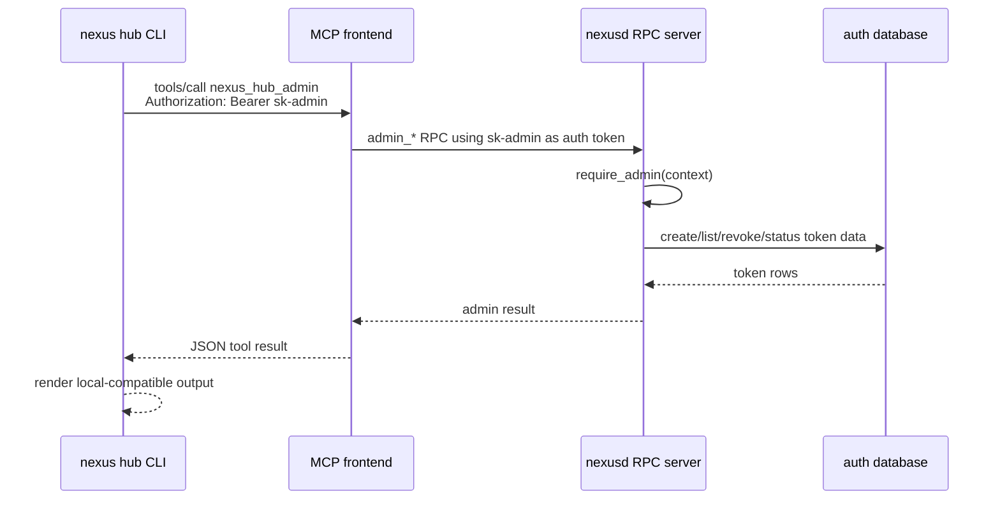

# Issue #3872 - Remote Hub Admin CLI Design

**Issue**: [#3872](https://github.com/nexi-lab/nexus/issues/3872) - remote admin CLI for hub mode

**Follows**: [#3784](https://github.com/nexi-lab/nexus/issues/3784) - hub mode

## Summary

Hub token administration currently requires direct database access through
`NEXUS_DATABASE_URL`, so `nexus hub token ...` must run on the hub host. Issue
#3872 adds an over-the-wire admin path for operators who have an admin bearer
token and want to manage hub tokens from a workstation.

The implementation should ship the full scope in one PR:

- `nexus hub token create --remote https://nexus.example.com --admin-token sk-...`
- `nexus hub token list --remote https://nexus.example.com --admin-token sk-...`
- `nexus hub token revoke <name|key_id> --remote ... --admin-token ...`
- `nexus hub status --remote https://nexus.example.com --admin-token sk-...`
- MCP-side admin RPC/tool coverage protected by the resolved request
  `is_admin` identity.

The remote path is MCP-only. `--remote https://host` normalizes to
`https://host/mcp`; an explicit `https://host/mcp` is accepted unchanged.

## Current State

`src/nexus/cli/commands/hub.py` implements the local `nexus hub` UX by opening
a SQLAlchemy session through `get_session_factory()`. The local token commands
already handle:

- token creation with `--zones`, `--zone`, `--zones-glob`, `--admin`,
  `--expires`, and `--user-id`;
- token listing with table and JSON output;
- token revocation by exact key ID, key ID prefix, or name;
- hub status with base and detailed output.

The server already has admin RPC handlers in
`src/nexus/server/rpc/handlers/admin.py` for `admin_create_key`,
`admin_list_keys`, `admin_get_key`, `admin_revoke_key`, and
`admin_update_key`. Those handlers call `require_admin(context)` before
touching auth state. The MCP server in `src/nexus/bricks/mcp/server.py`
already resolves per-request bearer tokens into remote `NexusFS` instances for
data-plane tools, but it does not expose a hub-specific admin tool.

## Goals

1. Preserve the local DB-backed `nexus hub` behavior when `--remote` is not
   provided.
2. Add remote token create/list/revoke/status over the MCP HTTP endpoint.
3. Reuse the existing server-side admin authorization rule: the bearer used as
   `--admin-token` must resolve to `is_admin=True`.
4. Keep remote output compatible with local output, including JSON shape for
   scripts.
5. Return a clear forbidden response for non-admin tokens.

## Non-Goals

- No direct workstation access to the hub RPC or gRPC port.
- No new REST admin endpoints.
- No remote support for `nexus hub token zones add/remove/show`; the issue
  acceptance covers create, list, revoke, and status.
- No change to bootstrap: the first admin token is still minted locally.

## Proposed Architecture

Add a single MCP tool named `nexus_hub_admin` that accepts an `action` string
and an action-specific argument object. The tool runs inside the MCP frontend
request context, uses the request bearer token to create a remote Nexus
connection, and delegates admin operations to the existing remote admin RPCs.

For example:

```json
{
  "action": "list_tokens",
  "arguments": {"show_revoked": false}
}
```

Remote CLI commands call this MCP tool through a lightweight streamable-HTTP
client rather than through `RPCTransport`. This keeps the operator-facing
network requirement aligned with hub deployment docs: the workstation only
needs the public MCP endpoint and the bootstrap admin token.

## MCP Tool Contract

Tool name: `nexus_hub_admin`

Arguments:

- `action`: one of `create_token`, `list_tokens`, `revoke_token`, `status`
- `arguments`: JSON object with the action payload

Responses are JSON strings so the CLI can parse them deterministically.

`create_token` arguments:

- `name`: token name
- `zones`: list of zone grants, each `{"zone_id": "...", "permissions": "rw"}`
- `zones_glob`: optional glob pattern resolved on the server
- `is_admin`: boolean
- `expires`: optional CLI duration string such as `90d`, `24h`, or `30m`
- `user_id`: optional token owner

`create_token` response:

- `key_id`
- `token`
- `name`
- `zones`
- `admin`
- `expires_at`

`list_tokens` arguments:

- `show_revoked`: boolean

`list_tokens` response:

- `tokens`: list of token records using the existing local JSON keys:
  `key_id`, `name`, `zone`, `zones`, `admin`, `created`, `last_used`,
  `revoked`, `revoked_at`

`revoke_token` arguments:

- `identifier`: token name, exact key ID, or key ID prefix

`revoke_token` response:

- `key_id`
- `name`
- `revoked`: true

`status` arguments:

- `detail`: boolean

`status` response:

- same base keys as local `hub status --json`: `endpoint`, `profile`,
  `postgres`, `redis`, `tokens`, `connections`, and `qps_5m`
- includes the same detail keys as local `hub status --detail --json` when
  `detail` is true and the remote server can collect them

## Authorization

The MCP tool must derive authority from the incoming MCP request bearer. It
must not accept an admin token inside the tool arguments.

The request flow is:

1. CLI sends `Authorization: Bearer <admin-token>` to the MCP `/mcp` endpoint.
2. MCP HTTP middleware stores the bearer in the existing request context var.
3. `nexus_hub_admin` resolves a remote `NexusFS` for that bearer using the
   existing per-request connection logic.
4. The tool calls `nx.admin.*` remote methods, which reach server-side admin
   RPC handlers.
5. Server-side `require_admin(context)` rejects non-admin tokens.

The remote CLI should translate permission failures into a user-facing
`ClickException` whose message includes that admin privileges are required. In
wire-level integration tests, the non-admin MCP call must surface a forbidden
admin failure. Depending on FastMCP transport semantics, this may be a
JSON-RPC tool error envelope rather than an HTTP status on the `tools/call`
request, but the rejection must come from the server-side admin check.

## CLI UX

Add shared options:

- `--remote URL`: MCP hub URL. If the path is absent or `/`, append `/mcp`.
- `--admin-token TOKEN`: admin bearer token. Also read from
  `NEXUS_HUB_ADMIN_TOKEN` for non-interactive use.

Remote mode activates when `--remote` is provided. In remote mode,
`--admin-token` is required.

Examples:

```bash
nexus hub token list --remote https://nexus.example.com --admin-token sk-admin
nexus hub token create --remote https://nexus.example.com --admin-token sk-admin \
  --name alice --zones eng:rw,ops:r --expires 90d
nexus hub token revoke alice --remote https://nexus.example.com --admin-token sk-admin
nexus hub status --remote https://nexus.example.com --admin-token sk-admin
```

The local path remains unchanged:

```bash
NEXUS_DATABASE_URL=postgresql://... nexus hub token list
```

## Data Flow



## Error Handling

- Missing `--admin-token` in remote mode: CLI error before network call.
- Invalid remote URL: CLI error before network call.
- MCP connection failure: CLI error naming the remote endpoint.
- Non-admin token: admin permission error from the server-side RPC path.
- Invalid action payload: MCP tool returns an invalid-input error.
- Ambiguous revoke identifier: same behavior as local revoke, with a clear
  ambiguous-token error.

## Testing

Tests should be written first.

Unit coverage:

- remote URL normalization helper;
- remote CLI payloads for create/list/revoke/status;
- remote CLI output parity for JSON and table output;
- missing `--admin-token` fails before any network call;
- MCP tool is registered and delegates to admin RPC paths;
- MCP admin tool rejects non-admin context through existing admin checks.

Integration coverage:

- streamable-HTTP MCP call with an admin token can list tokens;
- streamable-HTTP MCP call with a non-admin token receives a forbidden admin
  failure.

Manual/e2e coverage:

- `nexus hub token list --remote https://... --admin-token sk-...` returns the
  same JSON shape as local `nexus hub token list --json`.
- `create`, `revoke`, and `status` work from a workstation with no
  `NEXUS_DATABASE_URL` set.

## Documentation

Update `docs/hub-deploy.md`:

- mark remote admin CLI as implemented;
- show bootstrap flow: create one admin token locally, then operate remotely;
- document `--remote`, `--admin-token`, and `NEXUS_HUB_ADMIN_TOKEN`;
- keep the warning that the first admin token still requires direct hub-host DB
  access.

## Open Decisions Resolved

- Full issue scope lands in one PR.
- Remote admin is MCP-only.
- URL normalization accepts host-level URLs and appends `/mcp`.
- `token zones add/remove/show` remains local-only for this PR.
