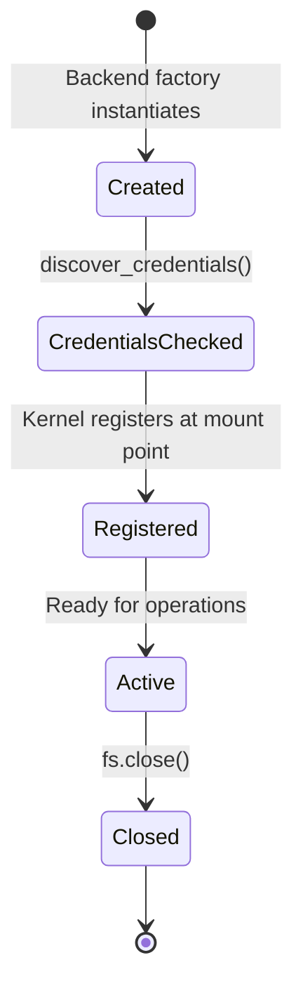

# How Backends Work

A backend is an adapter that translates nexus-fs operations (`read`,
`write`, `ls`, etc.) into calls to a specific storage system.

## Backend types

nexus-fs has two categories of backends:

### Storage backends (built-in)

These implement the core storage protocol directly:

| Backend | Scheme | Package |
|---------|--------|---------|
| Local filesystem | `local` | _(included)_ |
| Amazon S3 | `s3` | `boto3` |
| Google Cloud Storage | `gcs` | `google-cloud-storage` |

Storage backends support the full API: read, write, list, stat, delete,
rename, copy, mkdir.

### Connector backends (extensible)

These use a connector registry to support additional data sources:

| Backend | Scheme | Notes |
|---------|--------|-------|
| Google Drive | `gdrive` | OAuth required |
| Google Workspace | `gws` | Sheets, Docs, Calendar |
| Slack | `slack` | OAuth required |
| GitHub | `github` | Token required |

Connector backends are discovered lazily — the connector module is only
imported when a URI with its scheme is mounted.

## Credential discovery

When a cloud backend is created, nexus-fs runs credential discovery:

### AWS (S3)

The credential chain checks these sources in order:

1. Environment variables (`AWS_ACCESS_KEY_ID`, `AWS_SECRET_ACCESS_KEY`)
2. Shared credentials file (`~/.aws/credentials`)
3. AWS config file (`~/.aws/config`)
4. EC2/ECS instance metadata (via boto3)

If no credentials are found, `mount()` raises `CloudCredentialError`.

### GCP (GCS)

The credential chain checks:

1. `GOOGLE_APPLICATION_CREDENTIALS` environment variable
2. Application Default Credentials (`~/.config/gcloud/application_default_credentials.json`)
3. Compute Engine metadata service

### OAuth (Google Drive, Workspace, Slack)

OAuth backends require a one-time setup via `nexus-fs auth connect`.
Tokens are encrypted and stored at `~/.nexus/`.

## Backend lifecycle

1. **Created**: The backend factory instantiates the backend class based
   on the URI scheme.
2. **Credentials checked**: `discover_credentials()` validates that
   credentials are available. Fails fast if missing.
3. **Registered**: The kernel registers the backend at its mount point
   in the virtual filesystem namespace.
4. **Active**: The backend handles operations routed by the kernel.
5. **Closed**: `fs.close()` releases resources (connections, file handles).

## Content-addressable storage

For storage backends, nexus-fs uses content-addressable storage (CAS)
with Blake3 hashing. This enables:

- **Deduplication**: Identical content is stored once, regardless of
  how many paths reference it.
- **Integrity verification**: Content hashes verify data hasn't been
  corrupted.
- **Efficient copies**: `copy()` can be a metadata-only operation when
  the content already exists.

## Extending with new backends

nexus-fs uses a connector registry that maps URI schemes to backend
classes. When `mount()` encounters an unknown scheme, it:

1. Searches for a registered connector module
2. Lazily imports the module
3. Instantiates the connector with credential defaults

This makes nexus-fs extensible without modifying core code. The full
nexus-ai-fs package includes connectors for Slack, GitHub, Gmail, and
more.
